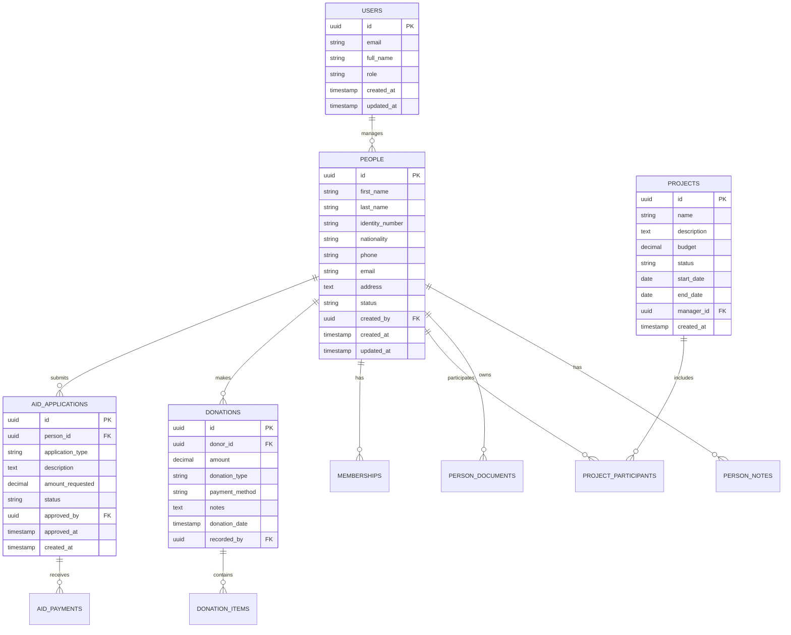

# KAFKASDER Dernek Yönetim Paneli - Veritabanı Şeması ve RLS Politikaları

## 1. Genel Bakış

KAFKASDER dernek yönetim paneli için kapsamlı PostgreSQL veritabanı şeması. Supabase Row Level Security (RLS) politikaları ile güvenli veri erişimi sağlanmaktadır.

## 2. Ana Modüller

* **Kişi Yönetimi**: Üyeler, yardım alanlar, gönüllüler

* **Yardım Yönetimi**: Başvurular, onaylar, takip

* **Bağış Yönetimi**: Bağışçılar, bağışlar, kampanyalar

* **Proje Yönetimi**: Proje takibi ve raporlama

* **Finansal Yönetim**: Ödemeler, aidatlar, muhasebe

* **Kullanıcı Yönetimi**: Roller, yetkiler, oturum yönetimi

## 3. Veri Modeli



## 4. Tablo Tanımları ve DDL

### 4.1 Kullanıcı Yönetimi

```sql
-- Kullanıcı profilleri tablosu
CREATE TABLE user_profiles (
    id UUID PRIMARY KEY REFERENCES auth.users(id) ON DELETE CASCADE,
    full_name VARCHAR(255) NOT NULL,
    role VARCHAR(50) NOT NULL CHECK (role IN ('YONETICI', 'PERSONEL', 'GONULLU', 'OKUYUCU')),
    phone VARCHAR(20),
    avatar_url TEXT,
    is_active BOOLEAN DEFAULT true,
    created_at TIMESTAMP WITH TIME ZONE DEFAULT NOW(),
    updated_at TIMESTAMP WITH TIME ZONE DEFAULT NOW()
);

-- İndeksler
CREATE INDEX idx_user_profiles_role ON user_profiles(role);
CREATE INDEX idx_user_profiles_active ON user_profiles(is_active);

-- RLS Politikaları
ALTER TABLE user_profiles ENABLE ROW LEVEL SECURITY;

CREATE POLICY "Users can view own profile" ON user_profiles
    FOR SELECT USING (auth.uid() = id);

CREATE POLICY "Admins can view all profiles" ON user_profiles
    FOR SELECT USING (
        EXISTS (
            SELECT 1 FROM user_profiles 
            WHERE id = auth.uid() AND role = 'YONETICI'
        )
    );

CREATE POLICY "Users can update own profile" ON user_profiles
    FOR UPDATE USING (auth.uid() = id);

CREATE POLICY "Admins can manage all profiles" ON user_profiles
    FOR ALL USING (
        EXISTS (
            SELECT 1 FROM user_profiles 
            WHERE id = auth.uid() AND role = 'YONETICI'
        )
    );

-- İzinler
GRANT SELECT ON user_profiles TO anon;
GRANT ALL PRIVILEGES ON user_profiles TO authenticated;
```

### 4.2 Kişi Yönetimi

```sql
-- Ana kişiler tablosu
CREATE TABLE people (
    id UUID PRIMARY KEY DEFAULT gen_random_uuid(),
    first_name VARCHAR(100) NOT NULL,
    last_name VARCHAR(100) NOT NULL,
    identity_number VARCHAR(20) UNIQUE,
    identity_type VARCHAR(20) DEFAULT 'TC' CHECK (identity_type IN ('TC', 'PASAPORT', 'YABANCI_KIMLIK')),
    nationality VARCHAR(50) DEFAULT 'T.C.' CHECK (nationality IN ('T.C.', 'SURIYE', 'CECENISTAN', 'AFGANISTAN', 'DIGER')),
    birth_date DATE,
    gender VARCHAR(10) CHECK (gender IN ('ERKEK', 'KADIN')),
    marital_status VARCHAR(20) CHECK (marital_status IN ('BEKAR', 'EVLI', 'DUL', 'BOSANMIS')),
    education_level VARCHAR(30) CHECK (education_level IN ('OKUR_YAZAR_DEGIL', 'ILKOKUL', 'ORTAOKUL', 'LISE', 'UNIVERSITE', 'YUKSEK_LISANS_DOKTORA')),
    employment_status VARCHAR(20) CHECK (employment_status IN ('CALISIYOR', 'ISSIZ', 'OGRENCI', 'EMEKLI', 'EV_HANIMI')),
    phone VARCHAR(20),
    email VARCHAR(255),
    address TEXT,
    city VARCHAR(100),
    district VARCHAR(100),
    postal_code VARCHAR(10),
    monthly_income DECIMAL(10,2),
    family_size INTEGER DEFAULT 1,
    housing_type VARCHAR(20) CHECK (housing_type IN ('KIRA', 'KENDINE_AIT', 'AKRABA_YANI', 'DIGER')),
    health_issues TEXT,
    blood_type VARCHAR(5) CHECK (blood_type IN ('A+', 'A-', 'B+', 'B-', 'AB+', 'AB-', '0+', '0-')),
    emergency_contact_name VARCHAR(255),
    emergency_contact_phone VARCHAR(20),
    emergency_contact_relation VARCHAR(50),
    status VARCHAR(20) DEFAULT 'AKTIF' CHECK (status IN ('AKTIF', 'PASIF', 'BEKLEMEDE')),
    person_type VARCHAR(20) DEFAULT 'YARDIM_ALAN' CHECK (person_type IN ('UYE', 'YARDIM_ALAN', 'GONULLU', 'BAGISCI')),
    registration_date DATE DEFAULT CURRENT_DATE,
    notes TEXT,
    created_by UUID REFERENCES auth.users(id),
    created_at TIMESTAMP WITH TIME ZONE DEFAULT NOW(),
    updated_at TIMESTAMP WITH TIME ZONE DEFAULT NOW()
);

-- İndeksler
CREATE INDEX idx_people_identity_number ON people(identity_number);
CREATE INDEX idx_people_name ON people(first_name, last_name);
CREATE INDEX idx_people_status ON people(status);
CREATE INDEX idx_people_type ON people(person_type);
CREATE INDEX idx_people_city ON people(city);
CREATE INDEX idx_people_created_by ON people(created_by);
CREATE INDEX idx_people_registration_date ON people(registration_date DESC);

-- RLS Politikaları
ALTER TABLE people ENABLE ROW LEVEL SECURITY;

CREATE POLICY "Authenticated users can view people" ON people
    FOR SELECT USING (auth.role() = 'authenticated');

CREATE POLICY "Staff can manage people" ON people
    FOR ALL USING (
        EXISTS (
            SELECT 1 FROM user_profiles 
            WHERE id = auth.uid() 
            AND role IN ('YONETICI', 'PERSONEL')
        )
    );

CREATE POLICY "Volunteers can view people" ON people
    FOR SELECT USING (
        EXISTS (
            SELECT 1 FROM user_profiles 
            WHERE id = auth.uid() 
            AND role IN ('YONETICI', 'PERSONEL', 'GONULLU')
        )
    );

-- İzinler
GRANT SELECT ON people TO anon;
GRANT ALL PRIVILEGES ON people TO authenticated;
```

### 4.3 Kişi Belgeleri

```sql
-- Kişi belgeleri tablosu
CREATE TABLE person_documents (
    id UUID PRIMARY KEY DEFAULT gen_random_uuid(),
    person_id UUID NOT NULL REFERENCES people(id) ON DELETE CASCADE,
    document_name VARCHAR(255) NOT NULL,
    document_type VARCHAR(50) NOT NULL CHECK (document_type IN (
        'KIMLIK', 'PASAPORT', 'IKAMETGAH', 'SAGLIK_RAPORU', 
        'DILEKCE', 'BASVURU_FORMU', 'RIZA_BEYANI', 'DIGER'
    )),
    file_path TEXT NOT NULL,
    file_size INTEGER,
    mime_type VARCHAR(100),
    uploaded_by UUID REFERENCES auth.users(id),
    uploaded_at TIMESTAMP WITH TIME ZONE DEFAULT NOW()
);

-- İndeksler
CREATE INDEX idx_person_documents_person_id ON person_documents(person_id);
CREATE INDEX idx_person_documents_type ON person_documents(document_type);

-- RLS Politikaları
ALTER TABLE person_documents ENABLE ROW LEVEL SECURITY;

CREATE POLICY "Staff can manage person documents" ON person_documents
    FOR ALL USING (
        EXISTS (
            SELECT 1 FROM user_profiles 
            WHERE id = auth.uid() 
            AND role IN ('YONETICI', 'PERSONEL')
        )
    );

-- İzinler
GRANT ALL PRIVILEGES ON person_documents TO authenticated;
```

### 4.4 Kişi Notları

```sql
-- Kişi notları tablosu
CREATE TABLE person_notes (
    id UUID PRIMARY KEY DEFAULT gen_random_uuid(),
    person_id UUID NOT NULL REFERENCES people(id) ON DELETE CASCADE,
    note_content TEXT NOT NULL,
    note_type VARCHAR(50) DEFAULT 'GENEL' CHECK (note_type IN (
        'GENEL', 'YARDIM', 'SAGLIK', 'SOSYAL', 'FINANSAL', 'ACIL'
    )),
    is_important BOOLEAN DEFAULT false,
    created_by UUID REFERENCES auth.users(id),
    created_at TIMESTAMP WITH TIME ZONE DEFAULT NOW()
);

-- İndeksler
CREATE INDEX idx_person_notes_person_id ON person_notes(person_id);
CREATE INDEX idx_person_notes_type ON person_notes(note_type);
CREATE INDEX idx_person_notes_important ON person_notes(is_important);
CREATE INDEX idx_person_notes_created_at ON person_notes(created_at DESC);

-- RLS Politikaları
ALTER TABLE person_notes ENABLE ROW LEVEL SECURITY;

CREATE POLICY "Staff can manage person notes" ON person_notes
    FOR ALL USING (
        EXISTS (
            SELECT 1 FROM user_profiles 
            WHERE id = auth.uid() 
            AND role IN ('YONETICI', 'PERSONEL')
        )
    );

-- İzinler
GRANT ALL PRIVILEGES ON person_notes TO authenticated;
```

### 4.5 Yardım Başvuruları

```sql
-- Yardım başvuruları tablosu
CREATE TABLE aid_applications (
    id UUID PRIMARY KEY DEFAULT gen_random_uuid(),
    person_id UUID NOT NULL REFERENCES people(id) ON DELETE CASCADE,
    application_type VARCHAR(50) NOT NULL CHECK (application_type IN (
        'NAKIT', 'GIDA', 'GIYIM', 'SAGLIK', 'EGITIM', 'BARINMA', 'YAKACAK', 'DIGER'
    )),
    title VARCHAR(255) NOT NULL,
    description TEXT NOT NULL,
    amount_requested DECIMAL(10,2),
    urgency_level VARCHAR(20) DEFAULT 'NORMAL' CHECK (urgency_level IN ('DUSUK', 'NORMAL', 'YUKSEK', 'ACIL')),
    status VARCHAR(20) DEFAULT 'BEKLEMEDE' CHECK (status IN (
        'BEKLEMEDE', 'INCELENIYOR', 'ONAYLANDI', 'REDDEDILDI', 'TAMAMLANDI', 'IPTAL'
    )),
    application_date DATE DEFAULT CURRENT_DATE,
    review_notes TEXT,
    reviewed_by UUID REFERENCES auth.users(id),
    reviewed_at TIMESTAMP WITH TIME ZONE,
    approved_by UUID REFERENCES auth.users(id),
    approved_at TIMESTAMP WITH TIME ZONE,
    rejection_reason TEXT,
    completion_date DATE,
    created_by UUID REFERENCES auth.users(id),
    created_at TIMESTAMP WITH TIME ZONE DEFAULT NOW(),
    updated_at TIMESTAMP WITH TIME ZONE DEFAULT NOW()
);

-- İndeksler
CREATE INDEX idx_aid_applications_person_id ON aid_applications(person_id);
CREATE INDEX idx_aid_applications_status ON aid_applications(status);
CREATE INDEX idx_aid_applications_type ON aid_applications(application_type);
CREATE INDEX idx_aid_applications_urgency ON aid_applications(urgency_level);
CREATE INDEX idx_aid_applications_date ON aid_applications(application_date DESC);
CREATE INDEX idx_aid_applications_approved_by ON aid_applications(approved_by);

-- RLS Politikaları
ALTER TABLE aid_applications ENABLE ROW LEVEL SECURITY;

CREATE POLICY "Staff can manage aid applications" ON aid_applications
    FOR ALL USING (
        EXISTS (
            SELECT 1 FROM user_profiles 
            WHERE id = auth.uid() 
            AND role IN ('YONETICI', 'PERSONEL')
        )
    );

CREATE POLICY "Volunteers can view aid applications" ON aid_applications
    FOR SELECT USING (
        EXISTS (
            SELECT 1 FROM user_profiles 
            WHERE id = auth.uid() 
            AND role IN ('YONETICI', 'PERSONEL', 'GONULLU')
        )
    );

-- İzinler
GRANT ALL PRIVILEGES ON aid_applications TO authenticated;
```

### 4.6 Yardım Ödemeleri

```sql
-- Yardım ödemeleri tablosu
CREATE TABLE aid_payments (
    id UUID PRIMARY KEY DEFAULT gen_random_uuid(),
    application_id UUID NOT NULL REFERENCES aid_applications(id) ON DELETE CASCADE,
    payment_amount DECIMAL(10,2) NOT NULL,
    payment_method VARCHAR(50) NOT NULL CHECK (payment_method IN (
        'NAKIT', 'BANKA_HAVALESI', 'KART', 'KOLI', 'FATURA_ODEMESI', 'DIGER'
    )),
    payment_date DATE NOT NULL,
    payment_reference VARCHAR(255),
    notes TEXT,
    paid_by UUID REFERENCES auth.users(id),
    created_at TIMESTAMP WITH TIME ZONE DEFAULT NOW()
);

-- İndeksler
CREATE INDEX idx_aid_payments_application_id ON aid_payments(application_id);
CREATE INDEX idx_aid_payments_date ON aid_payments(payment_date DESC);
CREATE INDEX idx_aid_payments_method ON aid_payments(payment_method);
CREATE INDEX idx_aid_payments_paid_by ON aid_payments(paid_by);

-- RLS Politikaları
ALTER TABLE aid_payments ENABLE ROW LEVEL SECURITY;

CREATE POLICY "Staff can manage aid payments" ON aid_payments
    FOR ALL USING (
        EXISTS (
            SELECT 1 FROM user_profiles 
            WHERE id = auth.uid() 
            AND role IN ('YONETICI', 'PERSONEL')
        )
    );

-- İzinler
GRANT ALL PRIVILEGES ON aid_payments TO authenticated;
```

### 4.7 Bağış Yönetimi

```sql
-- Bağışlar tablosu
CREATE TABLE donations (
    id UUID PRIMARY KEY DEFAULT gen_random_uuid(),
    donor_id UUID REFERENCES people(id),
    donor_name VARCHAR(255),
    donor_phone VARCHAR(20),
    donor_email VARCHAR(255),
    donation_type VARCHAR(50) NOT NULL CHECK (donation_type IN (
        'NAKIT', 'AYNI', 'KURBAN', 'ZEKAT', 'FITRE', 'KEFARET', 'DIGER'
    )),
    amount DECIMAL(10,2),
    currency VARCHAR(3) DEFAULT 'TRY',
    payment_method VARCHAR(50) CHECK (payment_method IN (
        'NAKIT', 'BANKA_HAVALESI', 'KREDI_KARTI', 'MOBIL_ODEME', 'DIGER'
    )),
    payment_reference VARCHAR(255),
    donation_date DATE NOT NULL,
    description TEXT,
    is_anonymous BOOLEAN DEFAULT false,
    is_regular BOOLEAN DEFAULT false,
    campaign_id UUID,
    project_id UUID,
    receipt_number VARCHAR(100),
    tax_receipt_requested BOOLEAN DEFAULT false,
    notes TEXT,
    recorded_by UUID REFERENCES auth.users(id),
    created_at TIMESTAMP WITH TIME ZONE DEFAULT NOW(),
    updated_at TIMESTAMP WITH TIME ZONE DEFAULT NOW()
);

-- İndeksler
CREATE INDEX idx_donations_donor_id ON donations(donor_id);
CREATE INDEX idx_donations_type ON donations(donation_type);
CREATE INDEX idx_donations_date ON donations(donation_date DESC);
CREATE INDEX idx_donations_amount ON donations(amount DESC);
CREATE INDEX idx_donations_campaign ON donations(campaign_id);
CREATE INDEX idx_donations_project ON donations(project_id);
CREATE INDEX idx_donations_recorded_by ON donations(recorded_by);

-- RLS Politikaları
ALTER TABLE donations ENABLE ROW LEVEL SECURITY;

CREATE POLICY "Staff can manage donations" ON donations
    FOR ALL USING (
        EXISTS (
            SELECT 1 FROM user_profiles 
            WHERE id = auth.uid() 
            AND role IN ('YONETICI', 'PERSONEL')
        )
    );

CREATE POLICY "Volunteers can view donations" ON donations
    FOR SELECT USING (
        EXISTS (
            SELECT 1 FROM user_profiles 
            WHERE id = auth.uid() 
            AND role IN ('YONETICI', 'PERSONEL', 'GONULLU')
        )
    );

-- İzinler
GRANT ALL PRIVILEGES ON donations TO authenticated;
```

### 4.8 Ayni Bağış Kalemleri

```sql
-- Ayni bağış kalemleri tablosu
CREATE TABLE donation_items (
    id UUID PRIMARY KEY DEFAULT gen_random_uuid(),
    donation_id UUID NOT NULL REFERENCES donations(id) ON DELETE CASCADE,
    item_name VARCHAR(255) NOT NULL,
    item_category VARCHAR(100) CHECK (item_category IN (
        'GIDA', 'GIYIM', 'MOBILYA', 'ELEKTRONIK', 'KITAP', 'OYUNCAK', 'DIGER'
    )),
    quantity INTEGER NOT NULL DEFAULT 1,
    unit VARCHAR(50) DEFAULT 'ADET',
    estimated_value DECIMAL(10,2),
    condition_status VARCHAR(50) CHECK (condition_status IN (
        'YENI', 'COK_IYI', 'IYI', 'ORTA', 'KULLANILABILIR'
    )),
    description TEXT,
    created_at TIMESTAMP WITH TIME ZONE DEFAULT NOW()
);

-- İndeksler
CREATE INDEX idx_donation_items_donation_id ON donation_items(donation_id);
CREATE INDEX idx_donation_items_category ON donation_items(item_category);
CREATE INDEX idx_donation_items_name ON donation_items(item_name);

-- RLS Politikaları
ALTER TABLE donation_items ENABLE ROW LEVEL SECURITY;

CREATE POLICY "Staff can manage donation items" ON donation_items
    FOR ALL USING (
        EXISTS (
            SELECT 1 FROM user_profiles 
            WHERE id = auth.uid() 
            AND role IN ('YONETICI', 'PERSONEL')
        )
    );

-- İzinler
GRANT ALL PRIVILEGES ON donation_items TO authenticated;
```

### 4.9 Proje Yönetimi

```sql
-- Projeler tablosu
CREATE TABLE projects (
    id UUID PRIMARY KEY DEFAULT gen_random_uuid(),
    name VARCHAR(255) NOT NULL,
    description TEXT,
    project_type VARCHAR(50) CHECK (project_type IN (
        'EGITIM', 'SAGLIK', 'SOSYAL', 'ALTYAPI', 'ACIL_YARDIM', 'DIGER'
    )),
    budget DECIMAL(12,2),
    spent_amount DECIMAL(12,2) DEFAULT 0,
    target_beneficiaries INTEGER,
    actual_beneficiaries INTEGER DEFAULT 0,
    start_date DATE,
    end_date DATE,
    status VARCHAR(20) DEFAULT 'PLANLANIYOR' CHECK (status IN (
        'PLANLANIYOR', 'AKTIF', 'BEKLEMEDE', 'TAMAMLANDI', 'IPTAL'
    )),
    priority_level VARCHAR(20) DEFAULT 'NORMAL' CHECK (priority_level IN (
        'DUSUK', 'NORMAL', 'YUKSEK', 'KRITIK'
    )),
    location VARCHAR(255),
    manager_id UUID REFERENCES auth.users(id),
    notes TEXT,
    created_by UUID REFERENCES auth.users(id),
    created_at TIMESTAMP WITH TIME ZONE DEFAULT NOW(),
    updated_at TIMESTAMP WITH TIME ZONE DEFAULT NOW()
);

-- İndeksler
CREATE INDEX idx_projects_status ON projects(status);
CREATE INDEX idx_projects_type ON projects(project_type);
CREATE INDEX idx_projects_manager ON projects(manager_id);
CREATE INDEX idx_projects_dates ON projects(start_date, end_date);
CREATE INDEX idx_projects_priority ON projects(priority_level);

-- RLS Politikaları
ALTER TABLE projects ENABLE ROW LEVEL SECURITY;

CREATE POLICY "Staff can manage projects" ON projects
    FOR ALL USING (
        EXISTS (
            SELECT 1 FROM user_profiles 
            WHERE id = auth.uid() 
            AND role IN ('YONETICI', 'PERSONEL')
        )
    );

CREATE POLICY "Project managers can manage own projects" ON projects
    FOR ALL USING (manager_id = auth.uid());

-- İzinler
GRANT ALL PRIVILEGES ON projects TO authenticated;
```

### 4.10 Proje Katılımcıları

```sql
-- Proje katılımcıları tablosu
CREATE TABLE project_participants (
    id UUID PRIMARY KEY DEFAULT gen_random_uuid(),
    project_id UUID NOT NULL REFERENCES projects(id) ON DELETE CASCADE,
    person_id UUID NOT NULL REFERENCES people(id) ON DELETE CASCADE,
    participation_type VARCHAR(50) CHECK (participation_type IN (
        'YARARLANICI', 'GONULLU', 'PERSONEL', 'KOORDINATOR'
    )),
    start_date DATE DEFAULT CURRENT_DATE,
    end_date DATE,
    status VARCHAR(20) DEFAULT 'AKTIF' CHECK (status IN (
        'AKTIF', 'TAMAMLANDI', 'AYRILDI', 'ASKIDA'
    )),
    notes TEXT,
    added_by UUID REFERENCES auth.users(id),
    created_at TIMESTAMP WITH TIME ZONE DEFAULT NOW(),
    UNIQUE(project_id, person_id)
);

-- İndeksler
CREATE INDEX idx_project_participants_project_id ON project_participants(project_id);
CREATE INDEX idx_project_participants_person_id ON project_participants(person_id);
CREATE INDEX idx_project_participants_type ON project_participants(participation_type);
CREATE INDEX idx_project_participants_status ON project_participants(status);

-- RLS Politikaları
ALTER TABLE project_participants ENABLE ROW LEVEL SECURITY;

CREATE POLICY "Staff can manage project participants" ON project_participants
    FOR ALL USING (
        EXISTS (
            SELECT 1 FROM user_profiles 
            WHERE id = auth.uid() 
            AND role IN ('YONETICI', 'PERSONEL')
        )
    );

-- İzinler
GRANT ALL PRIVILEGES ON project_participants TO authenticated;
```

### 4.11 Finansal Kayıtlar

```sql
-- Finansal işlemler tablosu
CREATE TABLE financial_transactions (
    id UUID PRIMARY KEY DEFAULT gen_random_uuid(),
    transaction_type VARCHAR(20) NOT NULL CHECK (transaction_type IN ('GELIR', 'GIDER')),
    category VARCHAR(100) NOT NULL,
    subcategory VARCHAR(100),
    amount DECIMAL(12,2) NOT NULL,
    currency VARCHAR(3) DEFAULT 'TRY',
    description TEXT NOT NULL,
    transaction_date DATE NOT NULL,
    payment_method VARCHAR(50),
    reference_number VARCHAR(255),
    related_person_id UUID REFERENCES people(id),
    related_project_id UUID REFERENCES projects(id),
    related_donation_id UUID REFERENCES donations(id),
    related_aid_payment_id UUID REFERENCES aid_payments(id),
    receipt_path TEXT,
    is_approved BOOLEAN DEFAULT false,
    approved_by UUID REFERENCES auth.users(id),
    approved_at TIMESTAMP WITH TIME ZONE,
    notes TEXT,
    recorded_by UUID REFERENCES auth.users(id),
    created_at TIMESTAMP WITH TIME ZONE DEFAULT NOW(),
    updated_at TIMESTAMP WITH TIME ZONE DEFAULT NOW()
);

-- İndeksler
CREATE INDEX idx_financial_transactions_type ON financial_transactions(transaction_type);
CREATE INDEX idx_financial_transactions_category ON financial_transactions(category);
CREATE INDEX idx_financial_transactions_date ON financial_transactions(transaction_date DESC);
CREATE INDEX idx_financial_transactions_amount ON financial_transactions(amount DESC);
CREATE INDEX idx_financial_transactions_approved ON financial_transactions(is_approved);
CREATE INDEX idx_financial_transactions_person ON financial_transactions(related_person_id);
CREATE INDEX idx_financial_transactions_project ON financial_transactions(related_project_id);

-- RLS Politikaları
ALTER TABLE financial_transactions ENABLE ROW LEVEL SECURITY;

CREATE POLICY "Admins can manage all financial transactions" ON financial_transactions
    FOR ALL USING (
        EXISTS (
            SELECT 1 FROM user_profiles 
            WHERE id = auth.uid() AND role = 'YONETICI'
        )
    );

CREATE POLICY "Staff can view financial transactions" ON financial_transactions
    FOR SELECT USING (
        EXISTS (
            SELECT 1 FROM user_profiles 
            WHERE id = auth.uid() 
            AND role IN ('YONETICI', 'PERSONEL')
        )
    );

-- İzinler
GRANT ALL PRIVILEGES ON financial_transactions TO authenticated;
```

### 4.12 Üyelik ve Aidatlar

```sql
-- Üyelikler tablosu
CREATE TABLE memberships (
    id UUID PRIMARY KEY DEFAULT gen_random_uuid(),
    person_id UUID NOT NULL REFERENCES people(id) ON DELETE CASCADE,
    membership_type VARCHAR(20) NOT NULL CHECK (membership_type IN (
        'STANDART', 'GONULLU', 'ONURSAL', 'FAHRI'
    )),
    membership_number VARCHAR(50) UNIQUE,
    start_date DATE NOT NULL,
    end_date DATE,
    status VARCHAR(20) DEFAULT 'AKTIF' CHECK (status IN (
        'AKTIF', 'PASIF', 'ASKIDA', 'IPTAL'
    )),
    monthly_fee DECIMAL(8,2),
    notes TEXT,
    approved_by UUID REFERENCES auth.users(id),
    created_at TIMESTAMP WITH TIME ZONE DEFAULT NOW(),
    updated_at TIMESTAMP WITH TIME ZONE DEFAULT NOW(),
    UNIQUE(person_id)
);

-- Aidatlar tablosu
CREATE TABLE membership_fees (
    id UUID PRIMARY KEY DEFAULT gen_random_uuid(),
    membership_id UUID NOT NULL REFERENCES memberships(id) ON DELETE CASCADE,
    period VARCHAR(20) NOT NULL, -- '2024-01', '2024-02' formatında
    amount DECIMAL(8,2) NOT NULL,
    due_date DATE NOT NULL,
    payment_date DATE,
    payment_method VARCHAR(50),
    payment_reference VARCHAR(255),
    status VARCHAR(20) DEFAULT 'BEKLEMEDE' CHECK (status IN (
        'BEKLEMEDE', 'ODENDI', 'GECIKTI', 'MUAF'
    )),
    notes TEXT,
    recorded_by UUID REFERENCES auth.users(id),
    created_at TIMESTAMP WITH TIME ZONE DEFAULT NOW(),
    UNIQUE(membership_id, period)
);

-- İndeksler
CREATE INDEX idx_memberships_person_id ON memberships(person_id);
CREATE INDEX idx_memberships_type ON memberships(membership_type);
CREATE INDEX idx_memberships_status ON memberships(status);
CREATE INDEX idx_memberships_number ON memberships(membership_number);

CREATE INDEX idx_membership_fees_membership_id ON membership_fees(membership_id);
CREATE INDEX idx_membership_fees_period ON membership_fees(period);
CREATE INDEX idx_membership_fees_status ON membership_fees(status);
CREATE INDEX idx_membership_fees_due_date ON membership_fees(due_date);

-- RLS Politikaları
ALTER TABLE memberships ENABLE ROW LEVEL SECURITY;
ALTER TABLE membership_fees ENABLE ROW LEVEL SECURITY;

CREATE POLICY "Staff can manage memberships" ON memberships
    FOR ALL USING (
        EXISTS (
            SELECT 1 FROM user_profiles 
            WHERE id = auth.uid() 
            AND role IN ('YONETICI', 'PERSONEL')
        )
    );

CREATE POLICY "Staff can manage membership fees" ON membership_fees
    FOR ALL USING (
        EXISTS (
            SELECT 1 FROM user_profiles 
            WHERE id = auth.uid() 
            AND role IN ('YONETICI', 'PERSONEL')
        )
    );

-- İzinler
GRANT ALL PRIVILEGES ON memberships TO authenticated;
GRANT ALL PRIVILEGES ON membership_fees TO authenticated;
```

### 4.13 Bildirimler ve Mesajlar

```SQL
-- Bildirimler tablosu
CREATE TABLE notifications (
    id UUID PRIMARY KEY DEFAULT gen_random_uuid(),
    recipient_id UUID REFERENCES auth.users(id) ON DELETE CASCADE,
    title VARCHAR(255) NOT NULL,
    message TEXT NOT NULL,
    notification_type VARCHAR(50) CHECK (notification_type IN (
        'BILGI', 'UYARI', 'HATA', 'BASARI', 'HATIRLATMA'
    )),
    priority VARCHAR(20) DEFAULT 'NORMAL' CHECK (priority IN (
        'DUSUK', 'NORMAL', 'YUKSEK', 'ACIL'
    )),
    is_read BOOLEAN DEFAULT false,
    read_at TIMESTAMP WITH TIME ZONE,
    related_entity_type VARCHAR(50),
    related_entity_id UUID,
    action_url TEXT,
    expires_at TIMESTAMP WITH TIME ZONE,
    created_by UUID REFERENCES auth.users(id),
    created_at TIMESTAMP WITH TIME ZONE DEFAULT NOW()
);

-- İndeksler
CREATE INDEX idx_notifications_recipient ON notifications(recipient_id);
CREATE INDEX idx_notifications_read ON notifications(is_read);
CREATE INDEX idx_notifications_type ON notifications(notification_type);
CREATE INDEX idx_notifications_priority ON notifications(priority);
CREATE INDEX idx_notifications_created_at ON notifications(created_at DESC);

-- RLS Politikaları
ALTER TABLE notifications ENABLE ROW LEVEL SECURITY;

CREATE POLICY "Users can view own notifications" ON notifications
    FOR SELECT USING (recipient_id = auth.uid());

CREATE POLICY "Users can update own notifications" ON notifications
    FOR UPDATE USING (recipient_id = auth.uid());

CREATE POLICY "Staff can create notifications" ON notifications
    FOR INSERT WITH CHECK (
        EXISTS (
            SELECT 1 FROM user_profiles 
            WHERE id = auth.uid() 
            AND role IN ('YONETICI', 'PERSONEL')
        )
    );

-- İzinler
GRANT ALL PRIVILEGES ON notifications TO authenticated;
```

### 4.14 Sistem Logları

```sql
-- Sistem aktivite logları
CREATE TABLE activity_logs (
    id UUID PRIMARY KEY DEFAULT gen_random_uuid(),
    user_id UUID REFERENCES auth.users(id),
    action VARCHAR(100) NOT NULL,
    entity_type VARCHAR(50) NOT NULL,
    entity_id UUID,
    old_values JSONB,
    new_values JSONB,
    ip_address INET,
    user_agent TEXT,
    created_at TIMESTAMP WITH TIME ZONE DEFAULT NOW()
);

-- İndeksler
CREATE INDEX idx_activity_logs_user_id ON activity_logs(user_id);
CREATE INDEX idx_activity_logs_action ON activity_logs(action);
CREATE INDEX idx_activity_logs_entity ON activity_logs(entity_type, entity_id);
CREATE INDEX idx_activity_logs_created_at ON activity_logs(created_at DESC);

-- RLS Politikaları
ALTER TABLE activity_logs ENABLE ROW LEVEL SECURITY;

CREATE POLICY "Admins can view all activity logs" ON activity_logs
    FOR SELECT USING (
        EXISTS (
            SELECT 1 FROM user_profiles 
            WHERE id = auth.uid() AND role = 'YONETICI'
        )
    );

CREATE POLICY "Users can view own activity logs" ON activity_logs
    FOR SELECT USING (user_id = auth.uid());

-- İzinler
GRANT ALL PRIVILEGES ON activity_logs TO authenticated;
```

## 5. Storage Buckets

```sql
-- Dosya depolama bucket'ları
INSERT INTO storage.buckets (id, name, public) VALUES 
    ('person-documents', 'person-documents', false),
    ('person-photos', 'person-photos', false),
    ('financial-receipts', 'financial-receipts', false),
    ('project-files', 'project-files', false),
    ('system-backups', 'system-backups', false);

-- Storage politikaları
CREATE POLICY "Staff can upload person documents" ON storage.objects
    FOR INSERT WITH CHECK (
        bucket_id = 'person-documents' AND 
        EXISTS (
            SELECT 1 FROM user_profiles 
            WHERE id = auth.uid() 
            AND role IN ('YONETICI', 'PERSONEL')
        )
    );

CREATE POLICY "Staff can view person documents" ON storage.objects
    FOR SELECT USING (
        bucket_id = 'person-documents' AND 
        EXISTS (
            SELECT 1 FROM user_profiles 
            WHERE id = auth.uid() 
            AND role IN ('YONETICI', 'PERSONEL')
        )
    );

CREATE POLICY "Staff can upload financial receipts" ON storage.objects
    FOR INSERT WITH CHECK (
        bucket_id = 'financial-receipts' AND 
        EXISTS (
            SELECT 1 FROM user_profiles 
            WHERE id = auth.uid() 
            AND role IN ('YONETICI', 'PERSONEL')
        )
    );

CREATE POLICY "Staff can view financial receipts" ON storage.objects
    FOR SELECT USING (
        bucket_id = 'financial-receipts' AND 
        EXISTS (
            SELECT 1 FROM user_profiles 
            WHERE id = auth.uid() 
            AND role IN ('YONETICI', 'PERSONEL')
        )
    );
```

## 6. Fonksiyonlar ve Tetikleyiciler

```sql
-- Updated_at otomatik güncelleme fonksiyonu
CREATE OR REPLACE FUNCTION update_updated_at_column()
RETURNS TRIGGER AS $$
BEGIN
    NEW.updated_at = NOW();
    RETURN NEW;
END;
$$ language 'plpgsql';

-- Updated_at tetikleyicileri
CREATE TRIGGER update_user_profiles_updated_at BEFORE UPDATE ON user_profiles FOR EACH ROW EXECUTE FUNCTION update_updated_at_column();
CREATE TRIGGER update_people_updated_at BEFORE UPDATE ON people FOR EACH ROW EXECUTE FUNCTION update_updated_at_column();
CREATE TRIGGER update_aid_applications_updated_at BEFORE UPDATE ON aid_applications FOR EACH ROW EXECUTE FUNCTION update_updated_at_column();
CREATE TRIGGER update_donations_updated_at BEFORE UPDATE ON donations FOR EACH ROW EXECUTE FUNCTION update_updated_at_column();
CREATE TRIGGER update_projects_updated_at BEFORE UPDATE ON projects FOR EACH ROW EXECUTE FUNCTION update_updated_at_column();
CREATE TRIGGER update_financial_transactions_updated_at BEFORE UPDATE ON financial_transactions FOR EACH ROW EXECUTE FUNCTION update_updated_at_column();
CREATE TRIGGER update_memberships_updated_at BEFORE UPDATE ON memberships FOR EACH ROW EXECUTE FUNCTION update_updated_at_column();

-- Aktivite log fonksiyonu
CREATE OR REPLACE FUNCTION log_activity()
RETURNS TRIGGER AS $$
BEGIN
    INSERT INTO activity_logs (user_id, action, entity_type, entity_id, old_values, new_values)
    VALUES (
        auth.uid(),
        TG_OP,
        TG_TABLE_NAME,
        COALESCE(NEW.id, OLD.id),
        CASE WHEN TG_OP = 'DELETE' THEN to_jsonb(OLD) ELSE NULL END,
        CASE WHEN TG_OP = 'INSERT' OR TG_OP = 'UPDATE' THEN to_jsonb(NEW) ELSE NULL END
    );
    RETURN COALESCE(NEW, OLD);
END;
$$ language 'plpgsql';

-- Aktivite log tetikleyicileri (önemli tablolar için)
CREATE TRIGGER log_people_activity AFTER INSERT OR UPDATE OR DELETE ON people FOR EACH ROW EXECUTE FUNCTION log_activity();
CREATE TRIGGER log_aid_applications_activity AFTER INSERT OR UPDATE OR DELETE ON aid_applications FOR EACH ROW EXECUTE FUNCTION log_activity();
CREATE TRIGGER log_donations_activity AFTER INSERT OR UPDATE OR DELETE ON donations FOR EACH ROW EXECUTE FUNCTION log_activity();
CREATE TRIGGER log_financial_transactions_activity AFTER INSERT OR UPDATE OR DELETE ON financial_transactions FOR EACH ROW EXECUTE FUNCTION log_activity();
```

## 7. Başlangıç Verileri

```sql
-- Varsayılan kullanıcı rolleri ve izinler
INSERT INTO user_profiles (id, full_name, role, is_active) VALUES
    ('00000000-0000-0000-0000-000000000001', 'Sistem Yöneticisi', 'YONETICI', true);

-- Örnek kategoriler ve alt kategoriler
INSERT INTO financial_transactions (transaction_type, category, subcategory, amount, description, transaction_date, recorded_by) VALUES
    ('GELIR', 'Bağışlar', 'Nakit Bağış', 0, 'Örnek gelir kategorisi', CURRENT_DATE, '00000000-0000-0000-0000-000000000001'),
    ('GIDER', 'Yardımlar', 'Nakit Yardım', 0, 'Örnek gider kategorisi', CURRENT_DATE, '00000000-0000-0000-0000-000000000001');

DELETE FROM financial_transactions WHERE amount = 0;
```

## 8. Performans Optimizasyonu

### 8.1 Önemli İndeksler

```sql
-- Kompozit indeksler
CREATE INDEX idx_people_status_type ON people(status, person_type);
CREATE INDEX idx_aid_applications_status_date ON aid_applications(status, application_date DESC);
CREATE INDEX idx_donations_date_type ON donations(donation_date DESC, donation_type);
CREATE INDEX idx_financial_transactions_date_type ON financial_transactions(transaction_date DESC, transaction_type);

-- Partial indeksler
CREATE INDEX idx_aid_applications_pending ON aid_applications(application_date DESC) WHERE status = 'BEKLEMEDE';
CREATE INDEX idx_notifications_unread ON notifications(created_at DESC) WHERE is_read = false;
CREATE INDEX idx_people_active ON people(first_name, last_name) WHERE status = 'AKTIF';
```

### 8.2 Görünümler (Views)

```sql
-- Aktif yardım başvuruları görünümü
CREATE VIEW active_aid_applications AS
SELECT 
    aa.*,
    p.first_name,
    p.last_name,
    p.phone,
    p.city
FROM aid_applications aa
JOIN people p ON aa.person_id = p.id
WHERE aa.status IN ('BEKLEMEDE', 'INCELENIYOR', 'ONAYLANDI');

-- Aylık finansal özet görünümü
CREATE VIEW monthly_financial_summary AS
SELECT 
    DATE_TRUNC('month', transaction_date) as month,
    transaction_type,
    category,
    SUM(amount) as total_amount,
    COUNT(*) as transaction_count
FROM financial_transactions
WHERE is_approved = true
GROUP BY DATE_TRUNC('month', transaction_date), transaction_type, category
ORDER BY month DESC, transaction_type, category;
```

## 9. Güvenlik Notları

1. **RLS Politikaları**: Tüm tablolarda Row Level Security aktif
2. **Rol Bazlı Erişim**: Kullanıcı rollerine göre veri erişimi
3. **Audit Trail**: Önemli işlemler için aktivite logları
4. **Veri Şifreleme**: Hassas veriler için ek şifreleme önerilir
5. **Backup Stratejisi**: Düzenli yedekleme planı uygulanmalı

## 10. Bakım ve İzleme

```sql
-- Performans izleme sorguları
-- En çok kullanılan tablolar
SELECT schemaname, tablename, n_tup_ins + n_tup_upd + n_tup_del as total_operations
FROM pg_stat_user_tables
ORDER BY total_operations DESC;

-- İndeks kullanım istatistikleri
SELECT schemaname, tablename, indexname, idx_scan, idx_tup_read
FROM pg_stat_user_indexes
ORDER BY idx_scan DESC;
```

Bu şema, KAFKASDER dernek yönetim paneli için kapsamlı bir veritabanı altyapısı sağlar ve güvenli, ölçeklenebilir bir sistem oluşturur.
