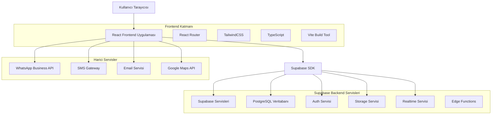
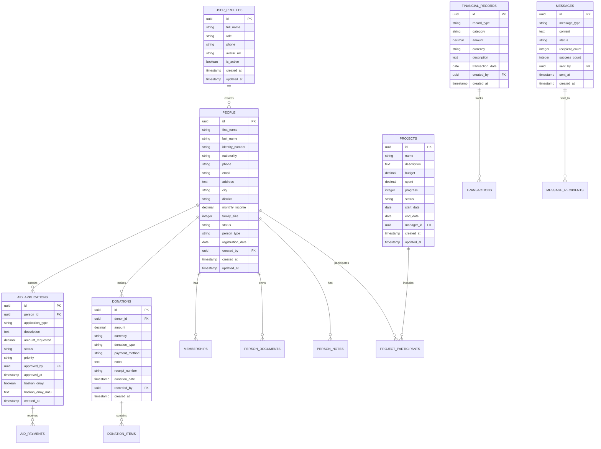
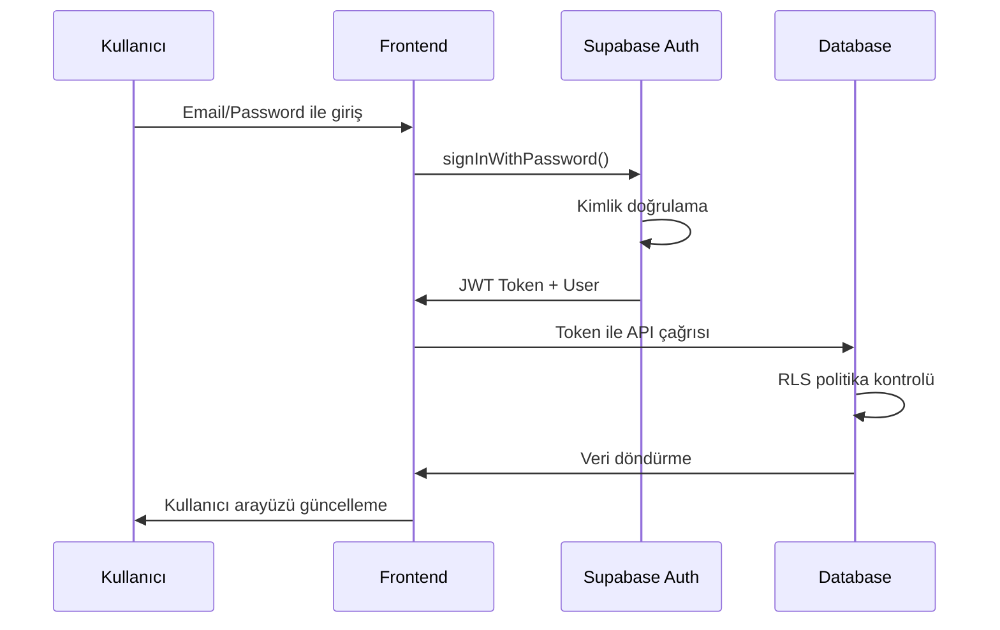

# KAFKASDER Dernek Yönetim Paneli - Detaylı Teknik Mimari

## 1. Mimari Tasarım



## 2. Teknoloji Açıklaması

### 2.1 Frontend Stack
- **React@18**: Modern React hooks ve functional components
- **TypeScript@5.8**: Tip güvenliği ve geliştirici deneyimi
- **Vite@6.2**: Hızlı build tool ve development server
- **TailwindCSS@4.1**: Utility-first CSS framework
- **React Router DOM@7.6**: Client-side routing
- **React Hot Toast@2.4**: Bildirim sistemi

### 2.2 Backend Servisleri
- **Supabase**: Backend-as-a-Service platform
  - PostgreSQL veritabanı
  - Row Level Security (RLS)
  - Realtime subscriptions
  - File storage
  - Authentication

### 2.3 Yardımcı Kütüphaneler
- **@heroicons/react@2.2**: İkon kütüphanesi
- **lucide-react@0.263**: Ek ikonlar
- **recharts@3.0**: Grafik ve chart bileşenleri
- **react-leaflet@4.2**: Harita entegrasyonu
- **xlsx@0.18**: Excel dosya işleme
- **jspdf@3.0**: PDF oluşturma
- **qrcode.react@4.2**: QR kod oluşturma
- **@zxing/library@0.21**: Barcode okuma

## 3. Route Tanımları

### 3.1 Ana Rotalar

| Route | Amaç | Bileşen |
|-------|------|----------|
| / | Ana sayfa, dashboard | Dashboard |
| /dashboard | Kontrol paneli | Dashboard |
| /kisiler | Kişi yönetimi ana sayfası | KisiYonetimi |
| /bagis-yonetimi | Bağış yönetimi | BagisYonetimi |
| /yardim-yonetimi | Yardım başvuru yönetimi | YardimBasvurulari |
| /projeler | Proje yönetimi | ProjeYonetimi |
| /finansal-kayitlar | Finansal raporlar | FinansalKayitlar |
| /toplu-iletisim | Mesajlaşma sistemi | TopluIletisim |
| /sistem-ayarlari | Sistem konfigürasyonu | Ayarlar |

### 3.2 Alt Rotalar

| Route | Amaç | Parent Route |
|-------|------|-------------|
| /bagis-yonetimi/nakit | Nakit bağış yönetimi | /bagis-yonetimi |
| /bagis-yonetimi/ayni | Ayni bağış yönetimi | /bagis-yonetimi |
| /yardim-yonetimi/nakdi-yardimlar | Nakdi yardım başvuruları | /yardim-yonetimi |
| /yardim-yonetimi/ayni-yardimlar | Ayni yardım başvuruları | /yardim-yonetimi |
| /yetim-yonetimi/yetim-kayitlari | Yetim kayıt sistemi | /yetim-yonetimi |
| /burs-yonetimi/basvurular | Burs başvuru sistemi | /burs-yonetimi |
| /hukuk-yonetimi/davalar | Hukuki dava takibi | /hukuk-yonetimi |

### 3.3 Korumalı Rotalar

Tüm rotalar `ProtectedRoute` bileşeni ile sarılmıştır ve kullanıcı rolüne göre erişim kontrolü yapılmaktadır.

## 4. API Tanımları

### 4.1 Supabase API Entegrasyonu

#### 4.1.1 Authentication API

**Giriş İşlemi**
```typescript
supabase.auth.signInWithPassword({
  email: string,
  password: string
})
```

**Çıkış İşlemi**
```typescript
supabase.auth.signOut()
```

**Oturum Kontrolü**
```typescript
supabase.auth.getSession()
```

#### 4.1.2 Database API

**Kişi Kayıtları**
```typescript
// Kişi listesi getirme
supabase
  .from('people')
  .select('*')
  .eq('status', 'AKTIF')
  .order('created_at', { ascending: false })

// Kişi ekleme
supabase
  .from('people')
  .insert({
    first_name: string,
    last_name: string,
    phone: string,
    // ... diğer alanlar
  })

// Kişi güncelleme
supabase
  .from('people')
  .update({ field: value })
  .eq('id', personId)
```

**Bağış Kayıtları**
```typescript
// Bağış listesi
supabase
  .from('donations')
  .select(`
    *,
    donor:people(first_name, last_name)
  `)
  .order('donation_date', { ascending: false })

// Bağış ekleme
supabase
  .from('donations')
  .insert({
    donor_id: string,
    amount: number,
    donation_type: string,
    payment_method: string
  })
```

**Yardım Başvuruları**
```typescript
// Başvuru listesi
supabase
  .from('aid_applications')
  .select(`
    *,
    applicant:people(first_name, last_name, phone)
  `)
  .eq('status', 'BEKLEYEN')

// Başvuru onaylama
supabase
  .from('aid_applications')
  .update({
    status: 'ONAYLANAN',
    approved_by: userId,
    approved_at: new Date().toISOString()
  })
  .eq('id', applicationId)
```

#### 4.1.3 Storage API

**Dosya Yükleme**
```typescript
supabase.storage
  .from('documents')
  .upload(`${personId}/${fileName}`, file)
```

**Dosya İndirme**
```typescript
supabase.storage
  .from('documents')
  .download(`${personId}/${fileName}`)
```

**Dosya URL'i Alma**
```typescript
supabase.storage
  .from('documents')
  .getPublicUrl(`${personId}/${fileName}`)
```

### 4.2 Harici API Entegrasyonları

#### 4.2.1 WhatsApp Business API

**Mesaj Gönderme**
```typescript
interface WhatsAppMessage {
  to: string;
  message: string;
  type: 'text' | 'template';
}

POST /api/whatsapp/send
Content-Type: application/json

{
  "to": "+905551234567",
  "message": "Merhaba, başvurunuz onaylanmıştır.",
  "type": "text"
}
```

#### 4.2.2 SMS Gateway API

**Toplu SMS Gönderimi**
```typescript
interface SMSRequest {
  recipients: string[];
  message: string;
  sender: string;
}

POST /api/sms/bulk-send
Content-Type: application/json

{
  "recipients": ["+905551234567", "+905559876543"],
  "message": "Dernek toplantısı yarın saat 14:00'te.",
  "sender": "KAFKASDER"
}
```

## 5. Veri Modeli

### 5.1 Ana Veri Modeli



### 5.2 Veri Tanım Dili (DDL)

#### 5.2.1 Kullanıcı Profilleri Tablosu

```sql
-- Kullanıcı profilleri tablosu
CREATE TABLE user_profiles (
    id UUID PRIMARY KEY REFERENCES auth.users(id) ON DELETE CASCADE,
    full_name VARCHAR(255) NOT NULL,
    role VARCHAR(50) NOT NULL CHECK (role IN ('YONETICI', 'PERSONEL', 'GONULLU', 'OKUYUCU')),
    phone VARCHAR(20),
    avatar_url TEXT,
    is_active BOOLEAN DEFAULT true,
    created_at TIMESTAMP WITH TIME ZONE DEFAULT NOW(),
    updated_at TIMESTAMP WITH TIME ZONE DEFAULT NOW()
);

-- İndeksler
CREATE INDEX idx_user_profiles_role ON user_profiles(role);
CREATE INDEX idx_user_profiles_active ON user_profiles(is_active);

-- RLS Politikaları
ALTER TABLE user_profiles ENABLE ROW LEVEL SECURITY;

CREATE POLICY "Users can view own profile" ON user_profiles
    FOR SELECT USING (auth.uid() = id);

CREATE POLICY "Admins can view all profiles" ON user_profiles
    FOR SELECT USING (
        EXISTS (
            SELECT 1 FROM user_profiles 
            WHERE id = auth.uid() AND role = 'YONETICI'
        )
    );

-- İzinler
GRANT SELECT ON user_profiles TO anon;
GRANT ALL PRIVILEGES ON user_profiles TO authenticated;
```

#### 5.2.2 Kişiler Tablosu

```sql
-- Ana kişiler tablosu
CREATE TABLE people (
    id UUID PRIMARY KEY DEFAULT gen_random_uuid(),
    first_name VARCHAR(100) NOT NULL,
    last_name VARCHAR(100) NOT NULL,
    identity_number VARCHAR(20) UNIQUE,
    identity_type VARCHAR(20) DEFAULT 'TC' CHECK (identity_type IN ('TC', 'PASAPORT', 'YABANCI_KIMLIK')),
    nationality VARCHAR(50) DEFAULT 'T.C.' CHECK (nationality IN ('T.C.', 'SURIYE', 'CECENISTAN', 'AFGANISTAN', 'DIGER')),
    birth_date DATE,
    gender VARCHAR(10) CHECK (gender IN ('ERKEK', 'KADIN')),
    marital_status VARCHAR(20) CHECK (marital_status IN ('BEKAR', 'EVLI', 'DUL', 'BOSANMIS')),
    education_level VARCHAR(30) CHECK (education_level IN ('OKUR_YAZAR_DEGIL', 'ILKOKUL', 'ORTAOKUL', 'LISE', 'UNIVERSITE', 'YUKSEK_LISANS_DOKTORA')),
    employment_status VARCHAR(20) CHECK (employment_status IN ('CALISIYOR', 'ISSIZ', 'OGRENCI', 'EMEKLI', 'EV_HANIMI')),
    phone VARCHAR(20),
    email VARCHAR(255),
    address TEXT,
    city VARCHAR(100),
    district VARCHAR(100),
    postal_code VARCHAR(10),
    monthly_income DECIMAL(10,2),
    family_size INTEGER DEFAULT 1,
    housing_type VARCHAR(20) CHECK (housing_type IN ('KIRA', 'KENDINE_AIT', 'AKRABA_YANI', 'DIGER')),
    health_issues TEXT,
    blood_type VARCHAR(5) CHECK (blood_type IN ('A+', 'A-', 'B+', 'B-', 'AB+', 'AB-', '0+', '0-')),
    emergency_contact_name VARCHAR(255),
    emergency_contact_phone VARCHAR(20),
    emergency_contact_relation VARCHAR(50),
    status VARCHAR(20) DEFAULT 'AKTIF' CHECK (status IN ('AKTIF', 'PASIF', 'BEKLEMEDE')),
    person_type VARCHAR(20) DEFAULT 'YARDIM_ALAN' CHECK (person_type IN ('UYE', 'YARDIM_ALAN', 'GONULLU', 'BAGISCI')),
    registration_date DATE DEFAULT CURRENT_DATE,
    notes TEXT,
    lat DECIMAL(10, 8),
    lng DECIMAL(11, 8),
    created_by UUID REFERENCES auth.users(id),
    created_at TIMESTAMP WITH TIME ZONE DEFAULT NOW(),
    updated_at TIMESTAMP WITH TIME ZONE DEFAULT NOW()
);

-- İndeksler
CREATE INDEX idx_people_identity_number ON people(identity_number);
CREATE INDEX idx_people_name ON people(first_name, last_name);
CREATE INDEX idx_people_status ON people(status);
CREATE INDEX idx_people_type ON people(person_type);
CREATE INDEX idx_people_city ON people(city);
CREATE INDEX idx_people_created_by ON people(created_by);
CREATE INDEX idx_people_registration_date ON people(registration_date DESC);
CREATE INDEX idx_people_location ON people(lat, lng);

-- RLS Politikaları
ALTER TABLE people ENABLE ROW LEVEL SECURITY;

CREATE POLICY "Authenticated users can view people" ON people
    FOR SELECT USING (auth.role() = 'authenticated');

CREATE POLICY "Staff can insert people" ON people
    FOR INSERT WITH CHECK (
        EXISTS (
            SELECT 1 FROM user_profiles 
            WHERE id = auth.uid() AND role IN ('YONETICI', 'PERSONEL')
        )
    );

CREATE POLICY "Staff can update people" ON people
    FOR UPDATE USING (
        EXISTS (
            SELECT 1 FROM user_profiles 
            WHERE id = auth.uid() AND role IN ('YONETICI', 'PERSONEL')
        )
    );

-- İzinler
GRANT SELECT ON people TO anon;
GRANT ALL PRIVILEGES ON people TO authenticated;
```

#### 5.2.3 Yardım Başvuruları Tablosu

```sql
-- Yardım başvuruları tablosu
CREATE TABLE aid_applications (
    id UUID PRIMARY KEY DEFAULT gen_random_uuid(),
    person_id UUID NOT NULL REFERENCES people(id) ON DELETE CASCADE,
    application_type VARCHAR(50) NOT NULL CHECK (application_type IN ('EGITIM', 'SAGLIK', 'ACIL', 'DIGER')),
    description TEXT NOT NULL,
    amount_requested DECIMAL(10,2) NOT NULL,
    priority VARCHAR(20) DEFAULT 'ORTA' CHECK (priority IN ('DUSUK', 'ORTA', 'YUKSEK')),
    status VARCHAR(30) DEFAULT 'BEKLEYEN' CHECK (status IN ('BEKLEYEN', 'INCELENEN', 'ONAYLANAN', 'REDDEDILEN', 'TAMAMLANAN', 'BASKAN_REDDETTI')),
    evaluation_notes TEXT,
    approved_by UUID REFERENCES auth.users(id),
    approved_at TIMESTAMP WITH TIME ZONE,
    baskan_onayi BOOLEAN,
    baskan_onay_notu TEXT,
    payment_id UUID,
    created_by UUID REFERENCES auth.users(id),
    created_at TIMESTAMP WITH TIME ZONE DEFAULT NOW(),
    updated_at TIMESTAMP WITH TIME ZONE DEFAULT NOW()
);

-- İndeksler
CREATE INDEX idx_aid_applications_person_id ON aid_applications(person_id);
CREATE INDEX idx_aid_applications_status ON aid_applications(status);
CREATE INDEX idx_aid_applications_priority ON aid_applications(priority);
CREATE INDEX idx_aid_applications_type ON aid_applications(application_type);
CREATE INDEX idx_aid_applications_created_at ON aid_applications(created_at DESC);
CREATE INDEX idx_aid_applications_approved_by ON aid_applications(approved_by);

-- RLS Politikaları
ALTER TABLE aid_applications ENABLE ROW LEVEL SECURITY;

CREATE POLICY "Authenticated users can view applications" ON aid_applications
    FOR SELECT USING (auth.role() = 'authenticated');

CREATE POLICY "Staff can manage applications" ON aid_applications
    FOR ALL USING (
        EXISTS (
            SELECT 1 FROM user_profiles 
            WHERE id = auth.uid() AND role IN ('YONETICI', 'PERSONEL')
        )
    );

-- İzinler
GRANT SELECT ON aid_applications TO anon;
GRANT ALL PRIVILEGES ON aid_applications TO authenticated;
```

#### 5.2.4 Bağışlar Tablosu

```sql
-- Bağışlar tablosu
CREATE TABLE donations (
    id UUID PRIMARY KEY DEFAULT gen_random_uuid(),
    donor_id UUID REFERENCES people(id) ON DELETE SET NULL,
    amount DECIMAL(10,2) NOT NULL,
    currency VARCHAR(3) DEFAULT 'TRY' CHECK (currency IN ('TRY', 'USD', 'EUR')),
    donation_type VARCHAR(30) NOT NULL CHECK (donation_type IN ('NAKIT', 'KREDI_KARTI', 'BANKA_TRANSFERI', 'ONLINE', 'AYNI')),
    payment_method VARCHAR(30),
    notes TEXT,
    receipt_number VARCHAR(50) UNIQUE,
    project_id UUID REFERENCES projects(id),
    donation_date TIMESTAMP WITH TIME ZONE DEFAULT NOW(),
    recorded_by UUID REFERENCES auth.users(id),
    created_at TIMESTAMP WITH TIME ZONE DEFAULT NOW(),
    updated_at TIMESTAMP WITH TIME ZONE DEFAULT NOW()
);

-- İndeksler
CREATE INDEX idx_donations_donor_id ON donations(donor_id);
CREATE INDEX idx_donations_type ON donations(donation_type);
CREATE INDEX idx_donations_date ON donations(donation_date DESC);
CREATE INDEX idx_donations_amount ON donations(amount DESC);
CREATE INDEX idx_donations_receipt ON donations(receipt_number);
CREATE INDEX idx_donations_project ON donations(project_id);

-- RLS Politikaları
ALTER TABLE donations ENABLE ROW LEVEL SECURITY;

CREATE POLICY "Authenticated users can view donations" ON donations
    FOR SELECT USING (auth.role() = 'authenticated');

CREATE POLICY "Staff can manage donations" ON donations
    FOR ALL USING (
        EXISTS (
            SELECT 1 FROM user_profiles 
            WHERE id = auth.uid() AND role IN ('YONETICI', 'PERSONEL')
        )
    );

-- İzinler
GRANT SELECT ON donations TO anon;
GRANT ALL PRIVILEGES ON donations TO authenticated;
```

## 6. Güvenlik Mimarisi

### 6.1 Authentication Flow



### 6.2 Row Level Security (RLS) Politikaları

#### 6.2.1 Rol Tabanlı Erişim

```sql
-- Yönetici tam erişim politikası
CREATE POLICY "Admins have full access" ON [table_name]
    FOR ALL USING (
        EXISTS (
            SELECT 1 FROM user_profiles 
            WHERE id = auth.uid() AND role = 'YONETICI'
        )
    );

-- Personel sınırlı erişim politikası
CREATE POLICY "Staff limited access" ON [table_name]
    FOR SELECT, INSERT, UPDATE USING (
        EXISTS (
            SELECT 1 FROM user_profiles 
            WHERE id = auth.uid() AND role IN ('YONETICI', 'PERSONEL')
        )
    );

-- Gönüllü okuma erişimi politikası
CREATE POLICY "Volunteers read access" ON [table_name]
    FOR SELECT USING (
        EXISTS (
            SELECT 1 FROM user_profiles 
            WHERE id = auth.uid() AND role IN ('YONETICI', 'PERSONEL', 'GONULLU')
        )
    );
```

### 6.3 Veri Şifreleme

- **Transit**: HTTPS/TLS 1.3
- **Rest**: Supabase otomatik şifreleme
- **Hassas Veriler**: Application-level şifreleme (kimlik numaraları)

## 7. Performans Optimizasyonu

### 7.1 Frontend Optimizasyonları

#### 7.1.1 Code Splitting

```typescript
// Lazy loading ile route-level code splitting
const Dashboard = lazy(() => import('./components/Dashboard'));
const KisiYonetimi = lazy(() => import('./components/KisiYonetimi'));
const BagisYonetimi = lazy(() => import('./components/BagisYonetimi'));

// Suspense ile loading state
<Suspense fallback={<LoadingSpinner />}>
  <Routes>
    <Route path="/" element={<Dashboard />} />
    <Route path="/kisiler" element={<KisiYonetimi />} />
    <Route path="/bagis-yonetimi" element={<BagisYonetimi />} />
  </Routes>
</Suspense>
```

#### 7.1.2 React Optimizasyonları

```typescript
// React.memo ile gereksiz re-render'ları önleme
const PersonCard = React.memo(({ person }: { person: Person }) => {
  return (
    <div className="card">
      {person.first_name} {person.last_name}
    </div>
  );
});

// useMemo ile expensive hesaplamaları cache'leme
const filteredPeople = useMemo(() => {
  return people.filter(person => 
    person.first_name.toLowerCase().includes(searchTerm.toLowerCase())
  );
}, [people, searchTerm]);

// useCallback ile function referanslarını stabilize etme
const handlePersonUpdate = useCallback((personId: string, data: Partial<Person>) => {
  updatePerson(personId, data);
}, [updatePerson]);
```

### 7.2 Database Optimizasyonları

#### 7.2.1 İndeks Stratejisi

```sql
-- Composite indeksler
CREATE INDEX idx_people_status_type ON people(status, person_type);
CREATE INDEX idx_applications_status_priority ON aid_applications(status, priority);
CREATE INDEX idx_donations_date_type ON donations(donation_date DESC, donation_type);

-- Partial indeksler
CREATE INDEX idx_people_active ON people(id) WHERE status = 'AKTIF';
CREATE INDEX idx_applications_pending ON aid_applications(created_at) WHERE status = 'BEKLEYEN';

-- GIN indeksler (full-text search için)
CREATE INDEX idx_people_search ON people USING GIN(to_tsvector('turkish', first_name || ' ' || last_name));
```

#### 7.2.2 Query Optimizasyonu

```sql
-- Efficient pagination
SELECT * FROM people 
WHERE status = 'AKTIF'
ORDER BY created_at DESC
LIMIT 20 OFFSET 0;

-- Join optimizasyonu
SELECT 
    a.*,
    p.first_name,
    p.last_name,
    p.phone
FROM aid_applications a
INNER JOIN people p ON a.person_id = p.id
WHERE a.status = 'BEKLEYEN'
ORDER BY a.priority DESC, a.created_at ASC;

-- Aggregate optimizasyonu
SELECT 
    COUNT(*) as total_applications,
    SUM(CASE WHEN status = 'BEKLEYEN' THEN 1 ELSE 0 END) as pending_count,
    SUM(CASE WHEN status = 'ONAYLANAN' THEN 1 ELSE 0 END) as approved_count
FROM aid_applications
WHERE created_at >= CURRENT_DATE - INTERVAL '30 days';
```

## 8. Monitoring ve Logging

### 8.1 Application Monitoring

```typescript
// Error boundary ile hata yakalama
class ErrorBoundary extends React.Component {
  componentDidCatch(error: Error, errorInfo: React.ErrorInfo) {
    // Log error to monitoring service
    console.error('Application Error:', error, errorInfo);
    
    // Send to external monitoring (Sentry, LogRocket, etc.)
    // monitoringService.captureException(error, errorInfo);
  }
}

// Performance monitoring
const performanceObserver = new PerformanceObserver((list) => {
  list.getEntries().forEach((entry) => {
    if (entry.entryType === 'navigation') {
      console.log('Page Load Time:', entry.duration);
    }
  });
});

performanceObserver.observe({ entryTypes: ['navigation', 'measure'] });
```

### 8.2 Database Monitoring

```sql
-- Slow query monitoring
SELECT 
    query,
    calls,
    total_time,
    mean_time,
    rows
FROM pg_stat_statements
WHERE mean_time > 1000
ORDER BY mean_time DESC;

-- Index usage monitoring
SELECT 
    schemaname,
    tablename,
    indexname,
    idx_scan,
    idx_tup_read,
    idx_tup_fetch
FROM pg_stat_user_indexes
WHERE idx_scan = 0;
```

## 9. Deployment ve DevOps

### 9.1 Build Konfigürasyonu

```typescript
// vite.config.ts
import { defineConfig } from 'vite';
import react from '@vitejs/plugin-react';
import { visualizer } from 'rollup-plugin-visualizer';

export default defineConfig({
  plugins: [
    react(),
    visualizer({
      filename: 'dist/stats.html',
      open: true,
      gzipSize: true,
      brotliSize: true,
    }),
  ],
  build: {
    rollupOptions: {
      output: {
        manualChunks: {
          vendor: ['react', 'react-dom'],
          supabase: ['@supabase/supabase-js'],
          ui: ['@heroicons/react', 'lucide-react'],
          charts: ['recharts'],
          utils: ['xlsx', 'jspdf', 'qrcode.react'],
        },
      },
    },
    chunkSizeWarningLimit: 1000,
  },
  optimizeDeps: {
    include: ['react', 'react-dom', '@supabase/supabase-js'],
  },
});
```

### 9.2 Environment Konfigürasyonu

```bash
# .env.production
VITE_SUPABASE_URL=https://your-project.supabase.co
VITE_SUPABASE_ANON_KEY=your-anon-key
VITE_APP_ENV=production
VITE_API_BASE_URL=https://api.kafkasder.org

# .env.development
VITE_SUPABASE_URL=https://your-dev-project.supabase.co
VITE_SUPABASE_ANON_KEY=your-dev-anon-key
VITE_APP_ENV=development
VITE_API_BASE_URL=http://localhost:3000
```

### 9.3 Vercel Deployment

```json
// vercel.json
{
  "framework": "vite",
  "buildCommand": "npm run build",
  "outputDirectory": "dist",
  "installCommand": "npm install",
  "devCommand": "npm run dev",
  "env": {
    "VITE_SUPABASE_URL": "@supabase-url",
    "VITE_SUPABASE_ANON_KEY": "@supabase-anon-key"
  },
  "headers": [
    {
      "source": "/(.*)",
      "headers": [
        {
          "key": "X-Content-Type-Options",
          "value": "nosniff"
        },
        {
          "key": "X-Frame-Options",
          "value": "DENY"
        },
        {
          "key": "X-XSS-Protection",
          "value": "1; mode=block"
        }
      ]
    }
  ],
  "rewrites": [
    {
      "source": "/(.*)",
      "destination": "/index.html"
    }
  ]
}
```

Bu teknik mimari dokümantasyonu, KAFKASDER Dernek Yönetim Paneli projesinin tüm teknik detaylarını kapsamaktadır ve geliştiriciler için rehber niteliğindedir.