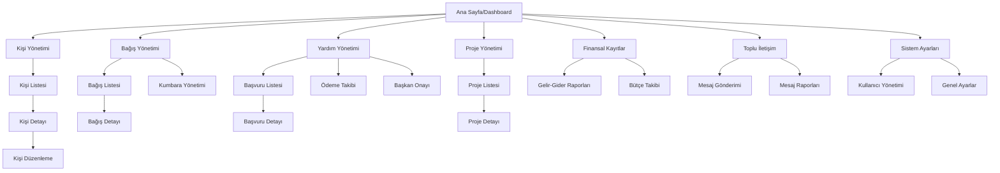

# KAFKASDER Dernek Yönetim Paneli - Kapsamlı Proje Dokümantasyonu

## 1. Proje Genel Bakış

KAFKASDER Dernek Yönetim Paneli, dernek faaliyetlerinin dijital ortamda yönetilmesi için geliştirilmiş kapsamlı bir web uygulamasıdır. Sistem, üye yönetiminden bağış takibine, yardım başvurularından proje yönetimine kadar derneğin tüm operasyonel süreçlerini destekler.

**Ana Amaçlar:**
- Dernek operasyonlarının dijitalleştirilmesi ve otomasyonu
- Şeffaf ve izlenebilir yardım süreçleri
- Etkin bağış yönetimi ve raporlama
- Kapsamlı üye ve gönüllü takip sistemi

**Hedef Kullanıcılar:** Dernek yöneticileri, personel, gönüllüler ve okuyucu yetkisine sahip kullanıcılar

## 2. Temel Özellikler

### 2.1 Kullanıcı Rolleri

| Rol | Kayıt Yöntemi | Temel Yetkiler |
|-----|---------------|----------------|
| Yönetici | Sistem yöneticisi tarafından oluşturulur | Tüm modüllere tam erişim, kullanıcı yönetimi |
| Personel | Yönetici tarafından davet | Operasyonel işlemler, veri girişi ve düzenleme |
| Gönüllü | Yönetici onayı ile | Sınırlı okuma ve veri girişi yetkileri |
| Okuyucu | Yönetici onayı ile | Sadece okuma yetkisi, rapor görüntüleme |

### 2.2 Ana Modüller

Sistem aşağıdaki ana sayfa ve modüllerden oluşmaktadır:

1. **Dashboard**: Ana kontrol paneli, istatistikler, son aktiviteler
2. **Kişi Yönetimi**: Üye, yardım alan, gönüllü ve bağışçı kayıtları
3. **Bağış Yönetimi**: Nakit ve ayni bağış takibi, kumbara yönetimi
4. **Yardım Yönetimi**: Başvuru süreçleri, onay mekanizmaları, ödeme takibi
5. **Proje Yönetimi**: Proje planlama, takip ve raporlama
6. **Finansal Yönetim**: Muhasebe, ödeme takibi, finansal raporlar
7. **İletişim Modülleri**: Toplu mesajlaşma, bildirimler
8. **Sistem Yönetimi**: Kullanıcı yönetimi, ayarlar, yedekleme

### 2.3 Sayfa Detayları

| Sayfa Adı | Modül Adı | Özellik Açıklaması |
|-----------|-----------|--------------------|
| Dashboard | Ana İstatistikler | Toplam üye sayısı, aylık bağış miktarı, aktif projeler, bekleyen başvurular |
| Dashboard | Son Aktiviteler | Yeni bağışlar, başvurular, onaylar listesi |
| Dashboard | Hızlı Erişim | Sık kullanılan işlemlere kısayollar |
| Kişi Yönetimi | Kişi Listesi | Filtreleme, arama, toplu işlemler, Excel export/import |
| Kişi Yönetimi | Kişi Detayı | Kişisel bilgiler, belgeler, fotoğraflar, notlar, yardım geçmişi |
| Kişi Yönetimi | Kişi Ekleme/Düzenleme | Form validasyonu, belge yükleme, harita entegrasyonu |
| Bağış Yönetimi | Bağış Listesi | Bağış türlerine göre filtreleme, tarih aralığı, tutar bazlı sıralama |
| Bağış Yönetimi | Bağış Detayı | Bağışçı bilgileri, ödeme detayları, makbuz oluşturma |
| Bağış Yönetimi | Kumbara Takibi | Kumbara lokasyonları, boşaltma tarihleri, QR kod yönetimi |
| Yardım Yönetimi | Başvuru Listesi | Durum bazlı filtreleme, öncelik sıralaması, toplu onay |
| Yardım Yönetimi | Başvuru Detayı | Başvuru formu, belgeler, değerlendirme notları, onay süreci |
| Yardım Yönetimi | Ödeme Takibi | Ödeme planlaması, gerçekleşen ödemeler, makbuz yönetimi |
| Proje Yönetimi | Proje Listesi | Proje durumları, bütçe takibi, ilerleme yüzdesi |
| Proje Yönetimi | Proje Detayı | Görev yönetimi, katılımcılar, bütçe detayları, dosya paylaşımı |
| Finansal Kayıtlar | Gelir-Gider | Kategori bazlı raporlama, grafik gösterimleri, Excel export |
| Finansal Kayıtlar | Bütçe Takibi | Yıllık bütçe planlaması, gerçekleşme oranları |
| Toplu İletişim | Mesaj Gönderimi | SMS/Email toplu gönderim, şablon yönetimi |
| Toplu İletişim | Mesaj Raporları | Gönderim başarı oranları, açılma istatistikleri |
| Sistem Ayarları | Kullanıcı Yönetimi | Rol atama, yetki yönetimi, kullanıcı aktivite logları |
| Sistem Ayarları | Genel Ayarlar | Sistem parametreleri, email/SMS konfigürasyonu |

## 3. Ana İş Akışları

### 3.1 Yardım Başvuru Süreci

1. **Başvuru Girişi**: Personel tarafından başvuru formu doldurulur
2. **Belge Yükleme**: Gerekli belgeler sisteme yüklenir
3. **Komisyon Değerlendirmesi**: Başvuru komisyon tarafından incelenir
4. **Başkan Onayı**: Onaylanan başvurular başkan onayına gönderilir
5. **Ödeme Planlaması**: Onaylanan başvurular için ödeme planlanır
6. **Ödeme Gerçekleştirme**: Ödeme yapılır ve makbuz oluşturulur
7. **Takip ve Raporlama**: Süreç boyunca takip ve raporlama yapılır

### 3.2 Bağış Yönetim Süreci

1. **Bağış Kaydı**: Nakit veya ayni bağış sisteme kaydedilir
2. **Makbuz Oluşturma**: Otomatik makbuz oluşturulur
3. **Kategorizasyon**: Bağış türü ve amacına göre kategorize edilir
4. **Raporlama**: Periyodik bağış raporları oluşturulur

### 3.3 Sayfa Navigasyon Akışı



## 4. Kullanıcı Arayüzü Tasarımı

### 4.1 Tasarım Stili

- **Ana Renkler**: 
  - Birincil: #3B82F6 (Mavi)
  - İkincil: #10B981 (Yeşil)
  - Uyarı: #F59E0B (Turuncu)
  - Hata: #EF4444 (Kırmızı)
- **Buton Stili**: Modern, yuvarlatılmış köşeler (rounded-md)
- **Font**: Inter, sistem fontları
- **Font Boyutları**: 14px (normal), 16px (başlıklar), 12px (küçük metinler)
- **Layout**: Sidebar navigasyon, kart tabanlı içerik düzeni
- **İkon Stili**: Heroicons ve Lucide React ikonları

### 4.2 Sayfa Tasarım Genel Bakışı

| Sayfa Adı | Modül Adı | UI Elementleri |
|-----------|-----------|----------------|
| Dashboard | Ana Panel | Grid layout, istatistik kartları, grafik bileşenleri, son aktivite listesi |
| Kişi Yönetimi | Kişi Listesi | DataTable, filtreleme sidebar, arama çubuğu, sayfalama |
| Kişi Detayı | Kişi Bilgileri | Tab yapısı, form alanları, belge galerisi, harita widget |
| Bağış Yönetimi | Bağış Formu | Multi-step form, dosya yükleme, tarih seçici, tutar girişi |
| Yardım Başvuruları | Başvuru Listesi | Kanban board görünümü, durum etiketleri, öncelik göstergeleri |
| Proje Yönetimi | Proje Dashboard | Progress bar, görev kartları, zaman çizelgesi, bütçe grafikleri |
| Finansal Raporlar | Grafik Paneli | Chart.js grafikleri, tarih aralığı seçici, export butonları |
| Sistem Ayarları | Konfigürasyon | Form grupları, toggle switch, dropdown menüler |

### 4.3 Responsive Tasarım

- **Desktop-first** yaklaşım
- **Tablet uyumluluğu**: 768px ve üzeri için optimize edilmiş
- **Mobil uyumluluk**: 640px ve altı için hamburger menü, stack layout
- **Touch optimizasyonu**: Mobil cihazlarda dokunmatik etkileşim desteği

## 5. Teknik Özellikler

### 5.1 Teknoloji Stack'i

- **Frontend**: React 18 + TypeScript + Vite
- **Styling**: TailwindCSS 4.1
- **State Management**: React Hooks (useState, useEffect, useContext)
- **Routing**: React Router DOM 7.6
- **Backend**: Supabase (PostgreSQL + Auth + Storage)
- **UI Kütüphaneleri**: 
  - Heroicons/React (ikonlar)
  - Lucide React (ek ikonlar)
  - React Hot Toast (bildirimler)
  - Recharts (grafikler)
  - React Leaflet (harita)
- **Dosya İşleme**: 
  - XLSX (Excel export/import)
  - jsPDF (PDF oluşturma)
  - html2canvas (ekran görüntüsü)
  - PapaParse (CSV işleme)
- **QR/Barcode**: 
  - QRCode.react (QR kod oluşturma)
  - @zxing/library (barcode okuma)

### 5.2 Proje Yapısı

```
kafkasder-panel/
├── components/          # React bileşenleri
│   ├── ui/             # Temel UI bileşenleri
│   ├── kisi/           # Kişi yönetimi bileşenleri
│   └── kisiDetay/      # Kişi detay bileşenleri
├── services/           # API servisleri
├── hooks/              # Custom React hooks
├── utils/              # Yardımcı fonksiyonlar
├── types/              # TypeScript tip tanımları
├── data/               # Mock veriler
├── constants/          # Sabit değerler
└── public/             # Statik dosyalar
```

### 5.3 Veritabanı Mimarisi

**Ana Tablolar:**
- `user_profiles`: Kullanıcı profilleri ve rolleri
- `people`: Kişi kayıtları (üye, yardım alan, gönüllü)
- `aid_applications`: Yardım başvuruları
- `donations`: Bağış kayıtları
- `projects`: Proje bilgileri
- `financial_records`: Finansal kayıtlar
- `messages`: Mesajlaşma kayıtları

**Güvenlik:**
- Row Level Security (RLS) politikaları
- Rol tabanlı erişim kontrolü
- Supabase Auth entegrasyonu

### 5.4 API Entegrasyonları

- **Supabase API**: Veritabanı işlemleri
- **Supabase Storage**: Dosya yükleme/indirme
- **Supabase Auth**: Kullanıcı kimlik doğrulama
- **WhatsApp Business API**: Mesajlaşma (opsiyonel)
- **Google Maps API**: Harita servisleri (opsiyonel)
- **SMS Gateway**: Toplu SMS gönderimi (opsiyonel)

## 6. Özel Modüller ve Özellikler

### 6.1 Yetim Yönetimi
- Yetim kayıtları ve sponsor eşleştirme
- Aylık destek takibi
- Eğitim durumu izleme

### 6.2 Öğrenci Burs Yönetimi
- Burs başvuru süreçleri
- Akademik başarı takibi
- Ödeme planlaması

### 6.3 Hukuki Yardım Modülü
- Dava takip sistemi
- Avukat atama
- Duruşma takvimi

### 6.4 Sağlık Yardımları
- Hastane sevk işlemleri
- Tedavi takibi
- Sağlık raporu yönetimi

### 6.5 Depo/Stok Yönetimi
- Ayni yardım stok takibi
- Minimum stok uyarıları
- Depo lokasyon yönetimi

### 6.6 Harita Entegrasyonu
- Kişi lokasyonları
- Kumbara konumları
- Coğrafi raporlama

### 6.7 Chatbot Yönetimi
- Otomatik yanıt sistemi
- Sık sorulan sorular
- Kullanıcı etkileşim analizi

## 7. Güvenlik ve Yetkilendirme

### 7.1 Kullanıcı Rolleri ve Yetkiler

- **YONETICI**: Tüm modüllere tam erişim
- **PERSONEL**: Operasyonel işlemler, veri girişi
- **GONULLU**: Sınırlı veri girişi ve okuma
- **OKUYUCU**: Sadece okuma yetkisi

### 7.2 Veri Güvenliği

- Supabase RLS politikaları
- Şifreli veri saklama
- Audit log kayıtları
- Düzenli yedekleme

## 8. Performans ve Optimizasyon

### 8.1 Frontend Optimizasyonları

- Lazy loading ile kod bölünmesi
- React.memo ile gereksiz render'ların önlenmesi
- Vite build optimizasyonları
- Image lazy loading

### 8.2 Backend Optimizasyonları

- Veritabanı indeksleri
- Query optimizasyonu
- Supabase edge functions (gerektiğinde)

## 9. Test ve Kalite Güvencesi

### 9.1 Test Stratejisi

- **Unit Tests**: Vitest ile bileşen testleri
- **Integration Tests**: React Testing Library
- **E2E Tests**: Cypress (planlanan)

### 9.2 Kod Kalitesi

- TypeScript strict mode
- ESLint konfigürasyonu
- Prettier code formatting
- Git hooks ile pre-commit kontrolleri

## 10. Deployment ve DevOps

### 10.1 Deployment Stratejisi

- **Production**: Vercel deployment
- **Staging**: Preview deployments
- **Development**: Local development server

### 10.2 CI/CD Pipeline

- GitHub Actions (planlanan)
- Otomatik test çalıştırma
- Build ve deployment otomasyonu

## 11. Dokümantasyon ve Eğitim

### 11.1 Teknik Dokümantasyon

- API dokümantasyonu
- Veritabanı şema dokümantasyonu
- Deployment kılavuzu

### 11.2 Kullanıcı Dokümantasyonu

- Kullanıcı kılavuzu
- Video eğitim materyalleri
- SSS dokümantasyonu

## 12. Gelecek Planları ve Roadmap

### 12.1 Kısa Vadeli (3-6 ay)

- Mobil uygulama geliştirme
- Gelişmiş raporlama modülü
- API entegrasyonları genişletme

### 12.2 Uzun Vadeli (6-12 ay)

- AI destekli analitik
- Blockchain entegrasyonu (şeffaflık için)
- Multi-tenant architecture

## 13. Bakım ve Destek

### 13.1 Bakım Stratejisi

- Düzenli güvenlik güncellemeleri
- Performans izleme
- Kullanıcı geri bildirim takibi

### 13.2 Destek Kanalları

- Teknik destek sistemi
- Kullanıcı eğitim programları
- Dokümantasyon güncellemeleri

Bu dokümantasyon, KAFKASDER Dernek Yönetim Paneli projesinin kapsamlı bir genel bakışını sunmaktadır. Proje sürekli gelişim halinde olup, kullanıcı ihtiyaçlarına göre güncellenmeye devam etmektedir.