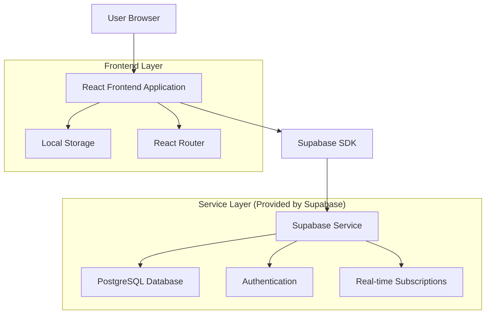
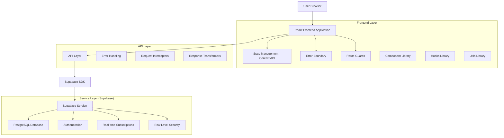
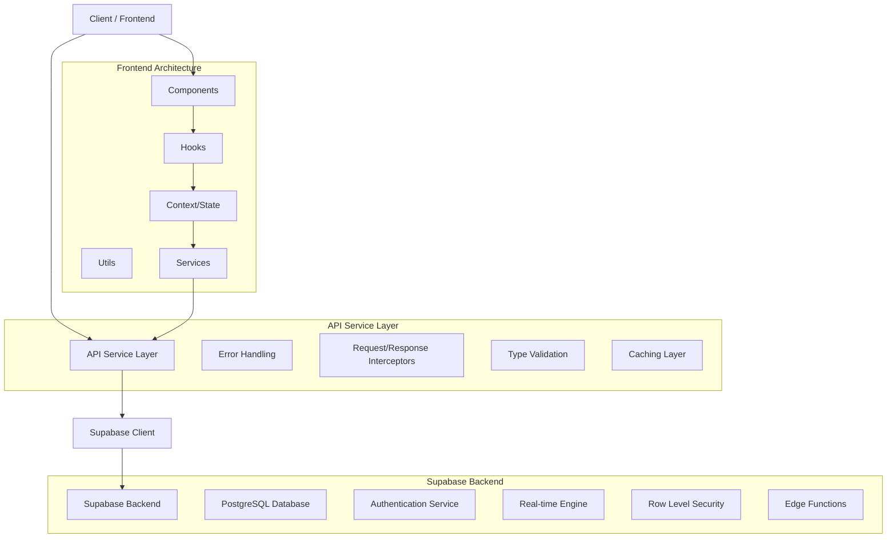
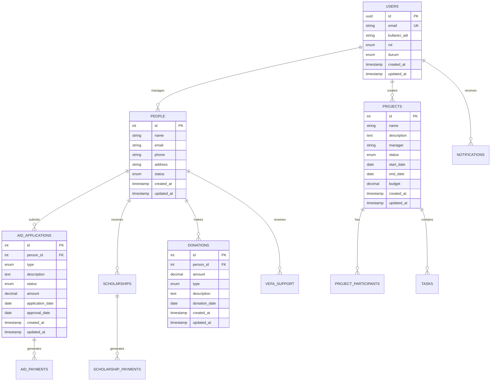

# KAFKASDER Teknik Mimari Dokümantasyonu

## 1. Mimari Tasarım

### Mevcut Mimari


### Önerilen İyileştirilmiş Mimari


## 2. Teknoloji Açıklaması

### Mevcut Stack
- **Frontend:** React@18 + TypeScript + Vite
- **Styling:** TailwindCSS@3
- **Routing:** React Router DOM@6
- **State Management:** React Context + useState/useEffect
- **Backend:** Supabase (PostgreSQL + Auth + Real-time)
- **UI Components:** Custom components + Heroicons
- **Notifications:** React Hot Toast
- **Build Tool:** Vite

### Önerilen İyileştirmeler
- **State Management:** Zustand veya Redux Toolkit eklenmesi
- **Form Management:** React Hook Form
- **Data Fetching:** TanStack Query (React Query)
- **Testing:** Vitest + React Testing Library
- **Code Quality:** ESLint + Prettier + Husky
- **Type Safety:** Strict TypeScript configuration
- **Performance:** React.memo, useMemo, useCallback optimizasyonları

## 3. Route Tanımları

### Mevcut Route Yapısı
| Route | Amaç | Koruma Seviyesi |
|-------|------|----------------|
| `/` | Ana sayfa (Dashboard) | Authenticated |
| `/login` | Giriş sayfası | Public |
| `/dashboard` | Dashboard | Authenticated |
| `/kisi-yonetimi` | Kişi yönetimi | Role-based |
| `/kisi/:id` | Kişi detayı | Role-based |
| `/projeler` | Proje yönetimi | Role-based |
| `/proje/:id` | Proje detayı | Role-based |
| `/yardim-basvurulari` | Yardım başvuruları | Role-based |
| `/yardim-basvurusu/:id` | Başvuru detayı | Role-based |
| `/ogrenci-burslari` | Öğrenci bursları | Role-based |
| `/ogrenci-bursu/:id` | Burs detayı | Role-based |
| `/bagislar` | Bağış yönetimi | Role-based |
| `/finansal-kayitlar` | Finansal kayıtlar | Admin only |
| `/kullanici-yonetimi` | Kullanıcı yönetimi | Admin only |
| `/ayarlar` | Sistem ayarları | Admin only |
| `/profil` | Kullanıcı profili | Authenticated |
| `/bildirimler` | Bildirimler | Authenticated |
| `/access-denied` | Erişim reddedildi | Public |

### Önerilen Route İyileştirmeleri
```typescript
// routes/index.ts
export const ROUTES = {
  PUBLIC: {
    LOGIN: '/login',
    ACCESS_DENIED: '/access-denied'
  },
  PROTECTED: {
    DASHBOARD: '/',
    PROFILE: '/profil',
    NOTIFICATIONS: '/bildirimler'
  },
  ADMIN: {
    USERS: '/kullanici-yonetimi',
    SETTINGS: '/ayarlar',
    FINANCIAL: '/finansal-kayitlar'
  },
  MODULES: {
    PEOPLE: {
      LIST: '/kisi-yonetimi',
      DETAIL: '/kisi/:id',
      CREATE: '/kisi-yonetimi/yeni',
      EDIT: '/kisi/:id/duzenle'
    },
    PROJECTS: {
      LIST: '/projeler',
      DETAIL: '/proje/:id',
      CREATE: '/projeler/yeni',
      EDIT: '/proje/:id/duzenle'
    }
    // ... diğer modüller
  }
} as const;
```

## 4. API Tanımları

### 4.1 Mevcut API Yapısı

**Authentication API**
```typescript
// Login
POST /auth/signin
Request: { email: string, password: string }
Response: { user: User, session: Session }

// Logout
POST /auth/signout
Response: { success: boolean }

// Get Profile
GET /auth/user
Response: { user: User | null }
```

**Core Entities API**
```typescript
// People Management
GET /people
Response: Person[]

GET /people/:id
Response: Person

POST /people
Request: CreatePersonInput
Response: Person

PUT /people/:id
Request: UpdatePersonInput
Response: Person

DELETE /people/:id
Response: { success: boolean }

// Projects Management
GET /projects
Response: Project[]

GET /projects/:id
Response: Project

POST /projects
Request: CreateProjectInput
Response: Project

PUT /projects/:id
Request: UpdateProjectInput
Response: Project

DELETE /projects/:id
Response: { success: boolean }
```

### 4.2 Önerilen API İyileştirmeleri

**Standardized Response Format**
```typescript
interface ApiResponse<T> {
  data: T;
  success: boolean;
  message?: string;
  errors?: string[];
  meta?: {
    pagination?: {
      page: number;
      limit: number;
      total: number;
      totalPages: number;
    };
    timestamp: string;
  };
}

// Error Response
interface ApiError {
  success: false;
  message: string;
  errors: string[];
  code: string;
  statusCode: number;
}
```

**Pagination Support**
```typescript
// GET /people?page=1&limit=20&search=john&sort=name:asc
interface PaginationParams {
  page?: number;
  limit?: number;
  search?: string;
  sort?: string;
  filter?: Record<string, any>;
}
```

**Batch Operations**
```typescript
// Bulk delete
DELETE /people/bulk
Request: { ids: number[] }
Response: { deletedCount: number }

// Bulk update
PUT /people/bulk
Request: { updates: Array<{ id: number; data: Partial<Person> }> }
Response: { updatedCount: number }
```

## 5. Sunucu Mimarisi Diyagramı



## 6. Veri Modeli

### 6.1 Veri Modeli Tanımı



### 6.2 Veri Tanım Dili (DDL)

**Kullanıcılar Tablosu**
```sql
-- Kullanıcılar tablosu (Supabase Auth ile entegre)
CREATE TABLE kullanicilar (
    id UUID PRIMARY KEY REFERENCES auth.users(id) ON DELETE CASCADE,
    email VARCHAR(255) UNIQUE NOT NULL,
    kullanici_adi VARCHAR(100) NOT NULL,
    rol VARCHAR(20) DEFAULT 'KULLANICI' CHECK (rol IN ('YONETICI', 'MODERATOR', 'KULLANICI')),
    durum VARCHAR(20) DEFAULT 'AKTIF' CHECK (durum IN ('AKTIF', 'PASIF', 'ASKIDA')),
    last_sign_in_at TIMESTAMP WITH TIME ZONE,
    created_at TIMESTAMP WITH TIME ZONE DEFAULT NOW(),
    updated_at TIMESTAMP WITH TIME ZONE DEFAULT NOW()
);

-- RLS (Row Level Security) politikaları
ALTER TABLE kullanicilar ENABLE ROW LEVEL SECURITY;

CREATE POLICY "Users can view their own profile" ON kullanicilar
    FOR SELECT USING (auth.uid() = id);

CREATE POLICY "Admins can view all users" ON kullanicilar
    FOR SELECT USING (
        EXISTS (
            SELECT 1 FROM kullanicilar 
            WHERE id = auth.uid() AND rol = 'YONETICI'
        )
    );
```

**Kişiler Tablosu**
```sql
CREATE TABLE people (
    id SERIAL PRIMARY KEY,
    name VARCHAR(255) NOT NULL,
    email VARCHAR(255),
    phone VARCHAR(20),
    address TEXT,
    birth_date DATE,
    gender VARCHAR(10) CHECK (gender IN ('ERKEK', 'KADIN')),
    marital_status VARCHAR(20) CHECK (marital_status IN ('BEKAR', 'EVLI', 'BOŞANMIŞ', 'DUL')),
    education_level VARCHAR(50),
    occupation VARCHAR(100),
    monthly_income DECIMAL(10,2),
    family_size INTEGER DEFAULT 1,
    notes TEXT,
    status VARCHAR(20) DEFAULT 'AKTIF' CHECK (status IN ('AKTIF', 'PASIF')),
    created_by UUID REFERENCES kullanicilar(id),
    created_at TIMESTAMP WITH TIME ZONE DEFAULT NOW(),
    updated_at TIMESTAMP WITH TIME ZONE DEFAULT NOW()
);

-- İndeksler
CREATE INDEX idx_people_name ON people(name);
CREATE INDEX idx_people_email ON people(email);
CREATE INDEX idx_people_phone ON people(phone);
CREATE INDEX idx_people_status ON people(status);
CREATE INDEX idx_people_created_at ON people(created_at DESC);
```

**Projeler Tablosu**
```sql
CREATE TABLE projects (
    id SERIAL PRIMARY KEY,
    name VARCHAR(255) NOT NULL,
    description TEXT,
    manager VARCHAR(255) NOT NULL,
    status VARCHAR(20) DEFAULT 'PLANLAMA' CHECK (status IN ('PLANLAMA', 'DEVAM_EDIYOR', 'TAMAMLANDI', 'IPTAL')),
    start_date DATE,
    end_date DATE,
    budget DECIMAL(12,2),
    spent_amount DECIMAL(12,2) DEFAULT 0,
    progress_percentage INTEGER DEFAULT 0 CHECK (progress_percentage >= 0 AND progress_percentage <= 100),
    priority VARCHAR(20) DEFAULT 'ORTA' CHECK (priority IN ('DÜŞÜK', 'ORTA', 'YÜKSEK', 'KRİTİK')),
    created_by UUID REFERENCES kullanicilar(id),
    created_at TIMESTAMP WITH TIME ZONE DEFAULT NOW(),
    updated_at TIMESTAMP WITH TIME ZONE DEFAULT NOW()
);

-- İndeksler
CREATE INDEX idx_projects_status ON projects(status);
CREATE INDEX idx_projects_manager ON projects(manager);
CREATE INDEX idx_projects_start_date ON projects(start_date);
CREATE INDEX idx_projects_priority ON projects(priority);
```

**Yardım Başvuruları Tablosu**
```sql
CREATE TABLE aid_applications (
    id SERIAL PRIMARY KEY,
    person_id INTEGER REFERENCES people(id) ON DELETE CASCADE,
    application_type VARCHAR(50) NOT NULL CHECK (application_type IN (
        'GIDA_YARDIMI', 'NAKDI_YARDIM', 'GIYIM_YARDIMI', 'YAKACAK_YARDIMI', 
        'SAGLIK_YARDIMI', 'EGITIM_YARDIMI', 'KONUT_YARDIMI', 'DIGER'
    )),
    description TEXT NOT NULL,
    requested_amount DECIMAL(10,2),
    approved_amount DECIMAL(10,2),
    status VARCHAR(20) DEFAULT 'BEKLEMEDE' CHECK (status IN (
        'BEKLEMEDE', 'INCELENIYOR', 'ONAYLANDI', 'REDDEDILDI', 'TAMAMLANDI'
    )),
    urgency_level VARCHAR(20) DEFAULT 'NORMAL' CHECK (urgency_level IN ('DÜŞÜK', 'NORMAL', 'YÜKSEK', 'ACİL')),
    application_date DATE DEFAULT CURRENT_DATE,
    review_date DATE,
    approval_date DATE,
    completion_date DATE,
    reviewer_id UUID REFERENCES kullanicilar(id),
    approver_id UUID REFERENCES kullanicilar(id),
    notes TEXT,
    created_by UUID REFERENCES kullanicilar(id),
    created_at TIMESTAMP WITH TIME ZONE DEFAULT NOW(),
    updated_at TIMESTAMP WITH TIME ZONE DEFAULT NOW()
);

-- İndeksler
CREATE INDEX idx_aid_applications_person_id ON aid_applications(person_id);
CREATE INDEX idx_aid_applications_status ON aid_applications(status);
CREATE INDEX idx_aid_applications_type ON aid_applications(application_type);
CREATE INDEX idx_aid_applications_date ON aid_applications(application_date DESC);
CREATE INDEX idx_aid_applications_urgency ON aid_applications(urgency_level);
```

**Trigger'lar ve Fonksiyonlar**
```sql
-- Updated_at otomatik güncelleme fonksiyonu
CREATE OR REPLACE FUNCTION update_updated_at_column()
RETURNS TRIGGER AS $$
BEGIN
    NEW.updated_at = NOW();
    RETURN NEW;
END;
$$ language 'plpgsql';

-- Trigger'ları ekle
CREATE TRIGGER update_people_updated_at BEFORE UPDATE ON people
    FOR EACH ROW EXECUTE FUNCTION update_updated_at_column();

CREATE TRIGGER update_projects_updated_at BEFORE UPDATE ON projects
    FOR EACH ROW EXECUTE FUNCTION update_updated_at_column();

CREATE TRIGGER update_aid_applications_updated_at BEFORE UPDATE ON aid_applications
    FOR EACH ROW EXECUTE FUNCTION update_updated_at_column();
```

**İlk Veri Ekleme**
```sql
-- Admin kullanıcı oluşturma (Supabase Auth üzerinden yapılacak)
-- Bu sadece profil bilgilerini ekler
INSERT INTO kullanicilar (id, email, kullanici_adi, rol) VALUES 
('00000000-0000-0000-0000-000000000000', 'admin@kafkasder.org', 'Admin', 'YONETICI');

-- Örnek kişiler
INSERT INTO people (name, email, phone, address, status) VALUES 
('Ahmet Yılmaz', 'ahmet@example.com', '+90 555 123 4567', 'İstanbul, Türkiye', 'AKTIF'),
('Fatma Demir', 'fatma@example.com', '+90 555 987 6543', 'Ankara, Türkiye', 'AKTIF'),
('Mehmet Kaya', 'mehmet@example.com', '+90 555 456 7890', 'İzmir, Türkiye', 'AKTIF');

-- Örnek projeler
INSERT INTO projects (name, description, manager, status, start_date, budget) VALUES 
('Ramazan Kumanya Projesi', 'Ramazan ayında ihtiyaç sahibi ailelere kumanya dağıtımı', 'Ali Veli', 'DEVAM_EDIYOR', '2024-03-01', 50000.00),
('Öğrenci Burs Programı', 'Başarılı öğrencilere eğitim bursu sağlanması', 'Ayşe Yılmaz', 'PLANLAMA', '2024-09-01', 100000.00);
```

Bu teknik mimari dokümantasyonu, KAFKASDER projesinin mevcut durumunu ve önerilen iyileştirmeleri kapsamlı bir şekilde açıklamaktadır.