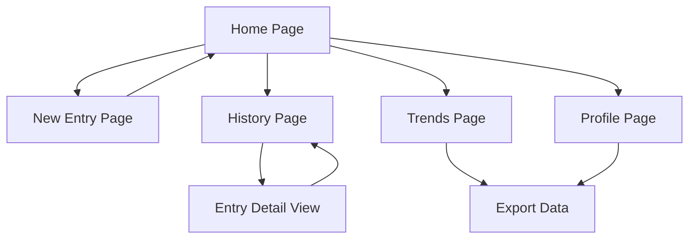

# Mood Journal App - Product Requirements Document

## 1. Product Overview
A daily mood tracking application that enables users to quickly log emotions, thoughts, and multimedia content for mental wellness and self-reflection.

The app helps users build consistent journaling habits by providing an intuitive interface for emotion tracking, multimedia note-taking, and insightful analytics to understand mood patterns over time.

## 2. Core Features

### 2.1 User Roles
| Role | Registration Method | Core Permissions |
|------|---------------------|------------------|
| User | Email/social registration | Can create, view, edit, and delete personal mood entries |

### 2.2 Feature Module
Our mood journal app consists of the following main pages:
1. **Home page**: quick entry creation, emotion selector, recent entries preview
2. **New Entry page**: emotion selection, text input, photo/voice recording, save functionality
3. **History page**: calendar view, entry list, search and filter options
4. **Trends page**: mood line charts, emotion pie charts, word cloud analytics
5. **Profile page**: user settings, data export, privacy controls

### 2.3 Page Details
| Page Name | Module Name | Feature description |
|-----------|-------------|---------------------|
| Home page | Quick Entry Widget | Display prominent "Log Today's Mood" button with emotion quick-select icons |
| Home page | Recent Entries | Show last 3-5 mood entries with emotion icons and preview text |
| Home page | Mood Streak | Display current consecutive days logged and motivational messaging |
| New Entry page | Emotion Selector | Present 8-10 primary emotions (happy, sad, anxious, calm, excited, angry, peaceful, stressed) with color-coded icons |
| New Entry page | Text Input | Provide expandable text area for thoughts, feelings, and daily reflections |
| New Entry page | Media Attachment | Enable photo capture/upload and voice note recording with playback |
| New Entry page | Save & Tags | Save entry with optional custom tags and automatic timestamp |
| History page | Calendar View | Interactive calendar showing mood colors for each logged day |
| History page | Entry List | Scrollable chronological list with emotion icons, dates, and text previews |
| History page | Search & Filter | Filter by emotion type, date range, and search within entry text |
| Trends page | Mood Line Chart | Weekly/monthly mood trend visualization with emotion intensity scoring |
| Trends page | Emotion Pie Chart | Breakdown of emotion frequency over selected time periods |
| Trends page | Word Cloud | Visual representation of most frequently used words in entries |
| Trends page | Insights Panel | AI-generated insights about mood patterns and suggestions |
| Profile page | Settings | Notification preferences, data backup, and privacy controls |
| Profile page | Export Data | Download mood data in CSV/PDF format for external analysis |

## 3. Core Process

**Daily Logging Flow:**
User opens app → Sees quick entry on homepage → Selects emotion → Writes optional text → Adds photo/voice note → Saves entry → Returns to homepage with updated streak

**History Review Flow:**
User navigates to History → Views calendar or list → Clicks specific entry → Reads full details → Can edit or delete entry

**Analytics Flow:**
User visits Trends page → Selects time period → Views mood charts → Reads word cloud → Reviews insights → Optionally exports data

## 4. User Interface Design

### 4.1 Design Style
- **Primary colors**: Soft pastels - lavender (#E6E6FA), sage green (#9CAF88), warm beige (#F5F5DC)
- **Secondary colors**: Muted blues (#B0C4DE), soft pinks (#F0E6FF), gentle yellows (#FFF8DC)
- **Button style**: Rounded corners (12px radius), soft shadows, gentle hover animations
- **Font**: Inter or Poppins, 16px base size, 18px for headers, 14px for secondary text
- **Layout style**: Card-based design with generous white space, floating action buttons
- **Icons**: Soft, rounded emotion icons with subtle gradients, nature-inspired elements

### 4.2 Page Design Overview
| Page Name | Module Name | UI Elements |
|-----------|-------------|-------------|
| Home page | Quick Entry Widget | Large, centered card with soft gradient background, prominent circular emotion selector buttons |
| Home page | Recent Entries | Horizontal scrollable cards with emotion color borders, fade-in animations |
| New Entry page | Emotion Selector | Grid of 8 large emotion buttons with icons, gentle pulse animation on selection |
| New Entry page | Text Input | Minimalist text area with soft focus states, character count, auto-resize |
| New Entry page | Media Attachment | Floating action buttons for camera/microphone with subtle icons |
| History page | Calendar View | Clean calendar grid with emotion color dots, smooth month transitions |
| History page | Entry List | Card-based layout with emotion icons, soft shadows, swipe gestures |
| Trends page | Charts | Soft color palettes for charts, smooth animations, interactive tooltips |
| Profile page | Settings | Toggle switches with soft colors, grouped sections with subtle dividers |

### 4.3 Responsiveness
Mobile-first design with touch-optimized interactions, responsive breakpoints at 768px and 1024px, gesture support for swipe navigation and pull-to-refresh functionality.