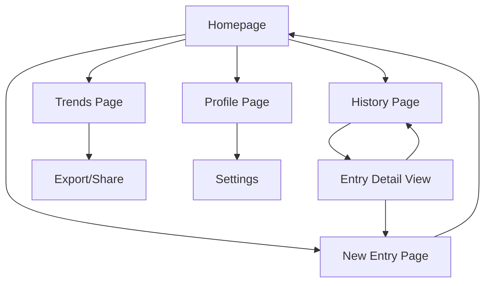

# Mood Journal App - Product Requirements Document

## 1. Product Overview
A personal mood tracking application that enables users to quickly log daily emotions and thoughts with multimedia support. The app focuses on mental wellness by providing intuitive emotion logging, rich note-taking capabilities, and insightful analytics to help users understand their emotional patterns over time.

## 2. Core Features

### 2.1 User Roles
| Role | Registration Method | Core Permissions |
|------|---------------------|------------------|
| User | Email/social registration | Can create, view, edit, and delete personal mood entries |

### 2.2 Feature Module
Our mood journal app consists of the following main pages:
1. **Homepage**: quick emotion selector, new entry button, recent entries preview
2. **New Entry Page**: emotion picker, text notes, photo/voice attachment, save functionality
3. **History Page**: chronological entry list, calendar view, search and filter options
4. **Trends Page**: mood analytics, line charts, word cloud, emotion breakdown charts
5. **Profile Page**: user settings, data export, privacy controls

### 2.3 Page Details
| Page Name | Module Name | Feature description |
|-----------|-------------|---------------------|
| Homepage | Quick Entry | Display prominent emotion selector with 8 core emotions (happy, sad, anxious, calm, excited, frustrated, content, overwhelmed). Show "Add Entry" button and preview of last 3 entries |
| Homepage | Recent Entries | Show mini cards of recent mood entries with emotion icon, date, and snippet of notes |
| New Entry | Emotion Selector | Present visual emotion picker with icons and colors. Allow single emotion selection with intensity slider (1-5) |
| New Entry | Note Taking | Provide text area for writing thoughts, feelings, or daily reflections with character counter |
| New Entry | Media Attachment | Enable photo capture/upload and voice note recording (max 2 minutes). Display attached media preview |
| New Entry | Entry Management | Save entry with timestamp, edit existing entries, delete functionality with confirmation |
| History | Entry List | Display chronological list of all entries with emotion icons, dates, and note previews. Implement infinite scroll |
| History | Calendar View | Show monthly calendar with emotion indicators on dates. Allow date selection to view specific entries |
| History | Search & Filter | Provide search by text content and filter by emotion type, date range, and media presence |
| Trends | Mood Timeline | Generate line chart showing mood trends over time (weekly/monthly/yearly views) with emotion intensity |
| Trends | Word Cloud | Create visual word cloud from entry text content, highlighting frequently used words and themes |
| Trends | Emotion Analytics | Display pie chart of emotion distribution, mood frequency statistics, and streak tracking |
| Trends | Insights | Show personalized insights like "Most common emotion this month" and "Longest positive streak" |
| Profile | User Settings | Manage notification preferences, data backup options, and privacy settings |
| Profile | Data Management | Provide data export (PDF/CSV), account deletion, and entry backup functionality |

## 3. Core Process

**Daily Mood Logging Flow:**
User opens app → Selects emotion from homepage → Adds intensity level → Writes optional notes → Attaches photo/voice (optional) → Saves entry → Returns to homepage with confirmation

**History Review Flow:**
User navigates to History → Views entries in list or calendar format → Selects specific entry → Views full details → Can edit or delete → Returns to history view

**Trends Analysis Flow:**
User accesses Trends page → Views mood timeline chart → Explores word cloud insights → Checks emotion breakdown → Reviews personalized insights → Can share or export data

## 4. User Interface Design

### 4.1 Design Style
- **Primary Colors**: Soft pastels - lavender (#E6E6FA), sage green (#9CAF88), warm beige (#F5F5DC)
- **Secondary Colors**: Muted blues (#B0C4DE), soft pinks (#F0E6FF), gentle yellows (#FFF8DC)
- **Button Style**: Rounded corners (12px radius), soft shadows, gentle hover animations
- **Typography**: Inter or Poppins font family, 16px base size, 1.5 line height for readability
- **Layout**: Card-based design with generous white space, floating action buttons, bottom navigation
- **Icons**: Soft, rounded emotion icons with subtle gradients, minimalist line icons for navigation

### 4.2 Page Design Overview
| Page Name | Module Name | UI Elements |
|-----------|-------------|-------------|
| Homepage | Quick Entry | Large circular emotion buttons in pastel colors, floating "+" button (sage green), soft card shadows |
| Homepage | Recent Entries | Horizontal scrolling cards with rounded corners, emotion icons (24px), soft typography |
| New Entry | Emotion Selector | Grid layout of emotion circles with gentle animations, intensity slider with gradient track |
| New Entry | Media Attachment | Camera icon button, voice recording with waveform visualization, preview thumbnails |
| History | Calendar View | Minimal calendar design with small emotion dots on dates, soft highlight for selected date |
| History | Entry List | Clean list items with left-aligned emotion icons, right-aligned timestamps, subtle dividers |
| Trends | Charts | Soft-colored line charts with rounded points, pastel pie charts, cloud-style word visualization |
| Profile | Settings | Toggle switches in brand colors, grouped settings in cards, gentle accent colors |

### 4.3 Responsiveness
Mobile-first design optimized for touch interactions. Responsive breakpoints at 768px and 1024px. Touch-friendly button sizes (minimum 44px), swipe gestures for navigation, and optimized keyboard input for text areas.