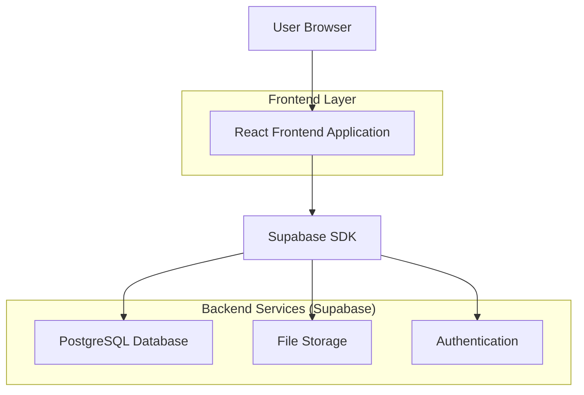
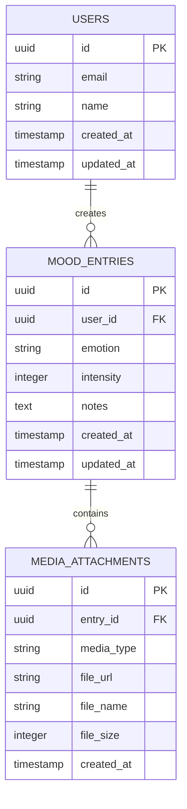

# Mood Journal App - Technical Architecture Document

## 1. Architecture Design



## 2. Technology Description

* Frontend: React\@18 + TypeScript + TailwindCSS\@3 + Vite

* Backend: Supabase (PostgreSQL + Auth + Storage)

* Charts: Chart.js or Recharts for analytics visualization

* Media: Browser APIs for camera/microphone access

* PWA: Service Worker for offline capabilities

## 3. Route Definitions

| Route      | Purpose                                                |
| ---------- | ------------------------------------------------------ |
| /          | Homepage with quick emotion logging and recent entries |
| /new-entry | Create new mood entry with emotion, notes, and media   |
| /history   | View all past entries in list or calendar format       |
| /trends    | Analytics dashboard with charts and insights           |
| /profile   | User settings and data management                      |
| /login     | User authentication page                               |
| /entry/:id | View/edit specific mood entry details                  |

## 4. API Definitions

### 4.1 Core API

**Mood Entries Management**

```
GET /api/entries
```

Request:

| Param Name | Param Type | isRequired | Description                              |
| ---------- | ---------- | ---------- | ---------------------------------------- |
| user\_id   | UUID       | true       | Authenticated user ID                    |
| limit      | number     | false      | Number of entries to fetch (default: 20) |
| offset     | number     | false      | Pagination offset                        |
| date\_from | string     | false      | Filter entries from date (ISO format)    |
| date\_to   | string     | false      | Filter entries to date (ISO format)      |
| emotion    | string     | false      | Filter by specific emotion               |

Response:

| Param Name   | Param Type | Description                |
| ------------ | ---------- | -------------------------- |
| entries      | array      | List of mood entries       |
| total\_count | number     | Total number of entries    |
| has\_more    | boolean    | Whether more entries exist |

```
POST /api/entries
```

Request:

| Param Name  | Param Type | isRequired | Description                                  |
| ----------- | ---------- | ---------- | -------------------------------------------- |
| emotion     | string     | true       | Selected emotion (happy, sad, anxious, etc.) |
| intensity   | number     | true       | Emotion intensity (1-5)                      |
| notes       | string     | false      | Text notes (max 1000 characters)             |
| photo\_url  | string     | false      | URL of uploaded photo                        |
| voice\_url  | string     | false      | URL of uploaded voice note                   |
| created\_at | timestamp  | true       | Entry timestamp                              |

Response:

| Param Name | Param Type | Description      |
| ---------- | ---------- | ---------------- |
| id         | UUID       | Created entry ID |
| success    | boolean    | Operation status |

**Analytics Data**

```
GET /api/analytics/trends
```

Request:

| Param Name | Param Type | isRequired | Description                     |
| ---------- | ---------- | ---------- | ------------------------------- |
| user\_id   | UUID       | true       | Authenticated user ID           |
| period     | string     | true       | Time period (week, month, year) |

Response:

| Param Name         | Param Type | Description                       |
| ------------------ | ---------- | --------------------------------- |
| mood\_timeline     | array      | Daily mood averages for chart     |
| emotion\_breakdown | object     | Emotion frequency counts          |
| word\_frequency    | array      | Most common words from notes      |
| insights           | object     | Personalized insights and streaks |

## 5. Data Model

### 5.1 Data Model Definition



### 5.2 Data Definition Language

**Users Table**

```sql
-- Create users table (handled by Supabase Auth)
CREATE TABLE profiles (
  id UUID REFERENCES auth.users(id) PRIMARY KEY,
  email VARCHAR(255) UNIQUE NOT NULL,
  name VARCHAR(100),
  timezone VARCHAR(50) DEFAULT 'UTC',
  notification_preferences JSONB DEFAULT '{}',
  created_at TIMESTAMP WITH TIME ZONE DEFAULT NOW(),
  updated_at TIMESTAMP WITH TIME ZONE DEFAULT NOW()
);

-- Enable RLS
ALTER TABLE profiles ENABLE ROW LEVEL SECURITY;

-- Create policies
CREATE POLICY "Users can view own profile" ON profiles
  FOR SELECT USING (auth.uid() = id);

CREATE POLICY "Users can update own profile" ON profiles
  FOR UPDATE USING (auth.uid() = id);

-- Grant permissions
GRANT SELECT ON profiles TO anon;
GRANT ALL PRIVILEGES ON profiles TO authenticated;
```

**Mood Entries Table**

```sql
-- Create mood_entries table
CREATE TABLE mood_entries (
  id UUID PRIMARY KEY DEFAULT gen_random_uuid(),
  user_id UUID REFERENCES profiles(id) ON DELETE CASCADE,
  emotion VARCHAR(20) NOT NULL CHECK (emotion IN ('happy', 'sad', 'anxious', 'calm', 'excited', 'frustrated', 'content', 'overwhelmed')),
  intensity INTEGER NOT NULL CHECK (intensity >= 1 AND intensity <= 5),
  notes TEXT,
  created_at TIMESTAMP WITH TIME ZONE DEFAULT NOW(),
  updated_at TIMESTAMP WITH TIME ZONE DEFAULT NOW()
);

-- Create indexes
CREATE INDEX idx_mood_entries_user_id ON mood_entries(user_id);
CREATE INDEX idx_mood_entries_created_at ON mood_entries(created_at DESC);
CREATE INDEX idx_mood_entries_emotion ON mood_entries(emotion);

-- Enable RLS
ALTER TABLE mood_entries ENABLE ROW LEVEL SECURITY;

-- Create policies
CREATE POLICY "Users can view own entries" ON mood_entries
  FOR SELECT USING (auth.uid() = user_id);

CREATE POLICY "Users can insert own entries" ON mood_entries
  FOR INSERT WITH CHECK (auth.uid() = user_id);

CREATE POLICY "Users can update own entries" ON mood_entries
  FOR UPDATE USING (auth.uid() = user_id);

CREATE POLICY "Users can delete own entries" ON mood_entries
  FOR DELETE USING (auth.uid() = user_id);

-- Grant permissions
GRANT SELECT ON mood_entries TO anon;
GRANT ALL PRIVILEGES ON mood_entries TO authenticated;
```

**Media Attachments Table**

```sql
-- Create media_attachments table
CREATE TABLE media_attachments (
  id UUID PRIMARY KEY DEFAULT gen_random_uuid(),
  entry_id UUID REFERENCES mood_entries(id) ON DELETE CASCADE,
  media_type VARCHAR(10) NOT NULL CHECK (media_type IN ('photo', 'voice')),
  file_url TEXT NOT NULL,
  file_name VARCHAR(255),
  file_size INTEGER,
  created_at TIMESTAMP WITH TIME ZONE DEFAULT NOW()
);

-- Create indexes
CREATE INDEX idx_media_attachments_entry_id ON media_attachments(entry_id);
CREATE INDEX idx_media_attachments_media_type ON media_attachments(media_type);

-- Enable RLS
ALTER TABLE media_attachments ENABLE ROW LEVEL SECURITY;

-- Create policies
CREATE POLICY "Users can view own media" ON media_attachments
  FOR SELECT USING (
    entry_id IN (
      SELECT id FROM mood_entries WHERE user_id = auth.uid()
    )
  );

CREATE POLICY "Users can insert own media" ON media_attachments
  FOR INSERT WITH CHECK (
    entry_id IN (
      SELECT id FROM mood_entries WHERE user_id = auth.uid()
    )
  );

CREATE POLICY "Users can delete own media" ON media_attachments
  FOR DELETE USING (
    entry_id IN (
      SELECT id FROM mood_entries WHERE user_id = auth.uid()
    )
  );

-- Grant permissions
GRANT SELECT ON media_attachments TO anon;
GRANT ALL PRIVILEGES ON media_attachments TO authenticated;
```

**Storage Buckets**

```sql
-- Create storage buckets for media files
INSERT INTO storage.buckets (id, name, public)
VALUES 
  ('mood-photos', 'mood-photos', false),
  ('mood-voice-notes', 'mood-voice-notes', false);

-- Create storage policies
CREATE POLICY "Users can upload own photos" ON storage.objects
  FOR INSERT WITH CHECK (
    bucket_id = 'mood-photos' AND
    auth.uid()::text = (storage.foldername(name))[1]
  );

CREATE POLICY "Users can view own photos" ON storage.objects
  FOR SELECT USING (
    bucket_id = 'mood-photos' AND
    auth.uid()::text = (storage.foldername(name))[1]
  );

CREATE POLICY "Users can upload own voice notes" ON storage.objects
  FOR INSERT WITH CHECK (
    bucket_id = 'mood-voice-notes' AND
    auth.uid()::text = (storage.foldername(name))[1]
  );

CREATE POLICY "Users can view own voice notes" ON storage.objects
  FOR SELECT USING (
    bucket_id = 'mood-voice-notes' AND
    auth.uid()::text = (storage.foldername(name))[1]
  );
```

**Initial Data**

```sql
-- Create emotion reference data (optional)
CREATE TABLE emotions (
  id SERIAL PRIMARY KEY,
  name VARCHAR(20) UNIQUE NOT NULL,
  color VARCHAR(7) NOT NULL,
  icon VARCHAR(50) NOT NULL
);

INSERT INTO emotions (name, color, icon) VALUES
  ('happy', '#FFE066', '😊'),
  ('sad', '#87CEEB', '😢'),
  ('anxious', '#DDA0DD', '😰'),
  ('calm', '#98FB98', '😌'),
  ('excited', '#FFB347', '🤩'),
  ('frustrated', '#F08080', '😤'),
  ('content', '#F0E68C', '😊'),
  ('overwhelmed', '#D3D3D3', '😵');
```

