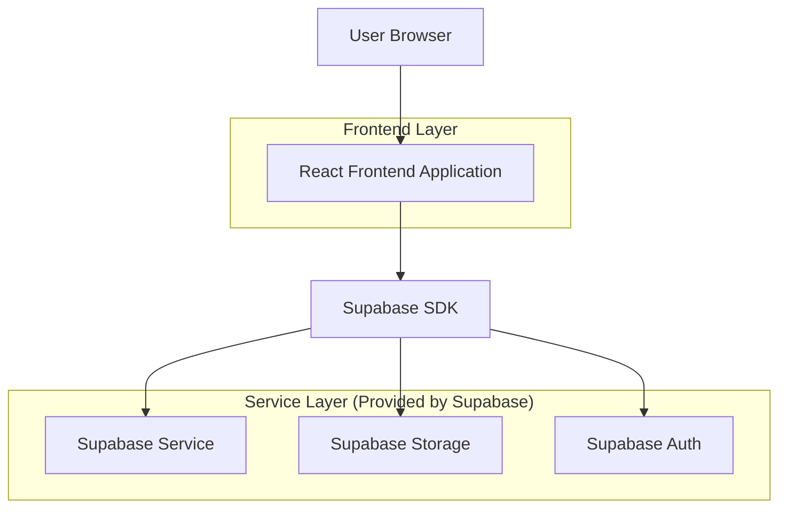
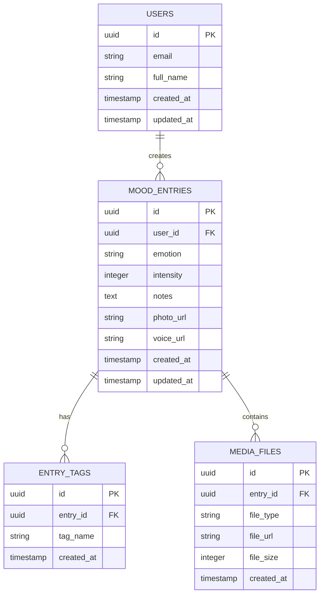

# Mood Journal App - Technical Architecture Document

## 1. Architecture Design



## 2. Technology Description

* Frontend: React\@18 + TypeScript + TailwindCSS\@3 + Vite

* Backend: Supabase (PostgreSQL + Auth + Storage)

* Charts: Chart.js or Recharts for mood analytics

* Media: Supabase Storage for photos and voice recordings

* PWA: Service Worker for offline capability

## 3. Route Definitions

| Route      | Purpose                                             |
| ---------- | --------------------------------------------------- |
| /          | Home page with quick entry and recent mood logs     |
| /new-entry | Create new mood entry with emotion, text, and media |
| /history   | View past entries in calendar or list format        |
| /trends    | Analytics dashboard with charts and insights        |
| /profile   | User settings and data management                   |
| /entry/:id | View/edit specific mood entry details               |

## 4. API Definitions

### 4.1 Core API

**Mood Entries**

```typescript
// Create new mood entry
POST /api/mood-entries
```

Request:

| Param Name | Param Type | isRequired | Description                                  |
| ---------- | ---------- | ---------- | -------------------------------------------- |
| emotion    | string     | true       | Selected emotion (happy, sad, anxious, etc.) |
| intensity  | number     | true       | Emotion intensity (1-5 scale)                |
| notes      | string     | false      | User's text notes                            |
| photo\_url | string     | false      | URL to uploaded photo                        |
| voice\_url | string     | false      | URL to uploaded voice recording              |
| tags       | string\[]  | false      | Custom tags for categorization               |

Response:

| Param Name  | Param Type | Description             |
| ----------- | ---------- | ----------------------- |
| id          | uuid       | Unique entry identifier |
| created\_at | timestamp  | Entry creation time     |
| user\_id    | uuid       | User identifier         |

**Get User Entries**

```typescript
GET /api/mood-entries?start_date=YYYY-MM-DD&end_date=YYYY-MM-DD
```

**Analytics Data**

```typescript
GET /api/analytics/mood-trends?period=week|month|year
```

## 5. Data Model

### 5.1 Data Model Definition



### 5.2 Data Definition Language

**Mood Entries Table**

```sql
-- Create mood_entries table
CREATE TABLE mood_entries (
  id UUID PRIMARY KEY DEFAULT gen_random_uuid(),
  user_id UUID REFERENCES auth.users(id) ON DELETE CASCADE,
  emotion VARCHAR(50) NOT NULL CHECK (emotion IN ('happy', 'sad', 'anxious', 'calm', 'excited', 'angry', 'peaceful', 'stressed', 'grateful', 'lonely')),
  intensity INTEGER NOT NULL CHECK (intensity >= 1 AND intensity <= 5),
  notes TEXT,
  photo_url TEXT,
  voice_url TEXT,
  created_at TIMESTAMP WITH TIME ZONE DEFAULT NOW(),
  updated_at TIMESTAMP WITH TIME ZONE DEFAULT NOW()
);

-- Create indexes
CREATE INDEX idx_mood_entries_user_id ON mood_entries(user_id);
CREATE INDEX idx_mood_entries_created_at ON mood_entries(created_at DESC);
CREATE INDEX idx_mood_entries_emotion ON mood_entries(emotion);

-- Row Level Security
ALTER TABLE mood_entries ENABLE ROW LEVEL SECURITY;

CREATE POLICY "Users can view own mood entries" ON mood_entries
  FOR SELECT USING (auth.uid() = user_id);

CREATE POLICY "Users can insert own mood entries" ON mood_entries
  FOR INSERT WITH CHECK (auth.uid() = user_id);

CREATE POLICY "Users can update own mood entries" ON mood_entries
  FOR UPDATE USING (auth.uid() = user_id);

CREATE POLICY "Users can delete own mood entries" ON mood_entries
  FOR DELETE USING (auth.uid() = user_id);

-- Grant permissions
GRANT SELECT ON mood_entries TO anon;
GRANT ALL PRIVILEGES ON mood_entries TO authenticated;
```

**Entry Tags Table**

```sql
-- Create entry_tags table
CREATE TABLE entry_tags (
  id UUID PRIMARY KEY DEFAULT gen_random_uuid(),
  entry_id UUID REFERENCES mood_entries(id) ON DELETE CASCADE,
  tag_name VARCHAR(50) NOT NULL,
  created_at TIMESTAMP WITH TIME ZONE DEFAULT NOW()
);

-- Create indexes
CREATE INDEX idx_entry_tags_entry_id ON entry_tags(entry_id);
CREATE INDEX idx_entry_tags_name ON entry_tags(tag_name);

-- Row Level Security
ALTER TABLE entry_tags ENABLE ROW LEVEL SECURITY;

CREATE POLICY "Users can manage tags for own entries" ON entry_tags
  FOR ALL USING (
    EXISTS (
      SELECT 1 FROM mood_entries 
      WHERE mood_entries.id = entry_tags.entry_id 
      AND mood_entries.user_id = auth.uid()
    )
  );

-- Grant permissions
GRANT SELECT ON entry_tags TO anon;
GRANT ALL PRIVILEGES ON entry_tags TO authenticated;
```

**Media Files Table**

```sql
-- Create media_files table
CREATE TABLE media_files (
  id UUID PRIMARY KEY DEFAULT gen_random_uuid(),
  entry_id UUID REFERENCES mood_entries(id) ON DELETE CASCADE,
  file_type VARCHAR(20) NOT NULL CHECK (file_type IN ('photo', 'voice')),
  file_url TEXT NOT NULL,
  file_size INTEGER,
  created_at TIMESTAMP WITH TIME ZONE DEFAULT NOW()
);

-- Create indexes
CREATE INDEX idx_media_files_entry_id ON media_files(entry_id);
CREATE INDEX idx_media_files_type ON media_files(file_type);

-- Row Level Security
ALTER TABLE media_files ENABLE ROW LEVEL SECURITY;

CREATE POLICY "Users can manage media for own entries" ON media_files
  FOR ALL USING (
    EXISTS (
      SELECT 1 FROM mood_entries 
      WHERE mood_entries.id = media_files.entry_id 
      AND mood_entries.user_id = auth.uid()
    )
  );

-- Grant permissions
GRANT SELECT ON media_files TO anon;
GRANT ALL PRIVILEGES ON media_files TO authenticated;
```

**Storage Buckets**

```sql
-- Create storage buckets
INSERT INTO storage.buckets (id, name, public) VALUES 
  ('mood-photos', 'mood-photos', false),
  ('voice-recordings', 'voice-recordings', false);

-- Storage policies
CREATE POLICY "Users can upload own photos" ON storage.objects
  FOR INSERT WITH CHECK (
    bucket_id = 'mood-photos' AND 
    auth.uid()::text = (storage.foldername(name))[1]
  );

CREATE POLICY "Users can view own photos" ON storage.objects
  FOR SELECT USING (
    bucket_id = 'mood-photos' AND 
    auth.uid()::text = (storage.foldername(name))[1]
  );

CREATE POLICY "Users can upload own voice recordings" ON storage.objects
  FOR INSERT WITH CHECK (
    bucket_id = 'voice-recordings' AND 
    auth.uid()::text = (storage.foldername(name))[1]
  );

CREATE POLICY "Users can view own voice recordings" ON storage.objects
  FOR SELECT USING (
    bucket_id = 'voice-recordings' AND 
    auth.uid()::text = (storage.foldername(name))[1]
  );
```

**Initial Data**

```sql
-- Sample emotions for reference
INSERT INTO mood_entries (user_id, emotion, intensity, notes) VALUES
  ('sample-user-id', 'happy', 4, 'Had a great day at work today!'),
  ('sample-user-id', 'calm', 3, 'Enjoyed a peaceful morning meditation'),
  ('sample-user-id', 'anxious', 2, 'Feeling a bit worried about tomorrow\'s presentation');
```

## 6. Future Enhancements

### 6.1 Çoklu Dil Desteği (i18n)
- React i18next entegrasyonu ile çoklu dil desteği
- Türkçe, İngilizce ve diğer diller için çeviri dosyaları
- Dinamik dil değiştirme özelliği
- Tarih ve saat formatlarının yerelleştirilmesi

### 6.2 CRM Entegrasyonları
- Salesforce, HubSpot gibi popüler CRM sistemleri ile entegrasyon
- Kullanıcı verilerinin CRM'e senkronizasyonu
- Otomatik lead takibi ve müşteri segmentasyonu
- API tabanlı veri alışverişi

### 6.3 E-Devlet API Bağlantıları
- Türkiye Cumhuriyeti E-Devlet Kapısı entegrasyonu
- Kimlik doğrulama servisleri
- Resmi belge entegrasyonları
- Güvenli veri transferi protokolleri

### 6.4 Redis Cache Implementasyonu
- Sık kullanılan verilerin önbelleğe alınması
- Session yönetimi için Redis kullanımı
- API yanıt sürelerinin iyileştirilmesi
- Gerçek zamanlı veri senkronizasyonu

### 6.5 Microservices Mimarisi
- Monolitik yapıdan microservices'e geçiş
- Bağımsız servis dağıtımları
- Container teknolojileri (Docker, Kubernetes)
- API Gateway implementasyonu
- Service mesh teknolojileri

### 6.6 Gelişmiş Analitik ve AI
- Makine öğrenmesi ile duygu durum analizi
- Predictive analytics için AI modelleri
- Kişiselleştirilmiş öneriler
- Doğal dil işleme (NLP) entegrasyonu

### 6.7 Güvenlik ve Compliance
- GDPR uyumluluğu
- End-to-end şifreleme
- Audit logging sistemi
- Penetrasyon testleri ve güvenlik taramaları
```

